# Spring Kafka: Zero to Hero - 01a: Asalu Endi ee Spring Kafka? 🤔

Namaste mawa! 🙏 Mana "Zero to Hero" series loki swagatham. Ee journey lo manam Spring Kafka gurinchi A to Z nerchukundam.

First question: **Asalu Apache Kafka ante enti?**
Simple ga cheppali ante, Kafka anedi oka super-fast post office 📮 lantiది. Oka chota nunchi (producer) messages ni theeskuni, inkoka chotaki (consumer) deliver chestundi. Kani idi mamulu post office kadu, chala high-speed and reliable. Lakhs of messages ni handle cheyagaladu, and data ni safe ga store cheyagaladu.

**Maro problem enti?**
Kafka ni Java tho vaadali ante, manam antha code rayali. Producer ni create cheyali, consumer ni manage cheyali, connections, error handling... chala pani untadi. Deenine **boilerplate code** antaru.

### Enter Spring for Apache Kafka! ✨

Ikkade mana hero, Spring Kafka, entry istadu! 🦸‍♂️

Spring vaadu antadu, "Mawa, nuvvu antha kashtapadaku. Nenu unna ga. Nuvvu nee business logic meeda focus chey, ee chinna chinna panulu anni nenu chuskunta."

**Spring Kafka vaadatam valla benefits enti?**

1.  **Thక్కువ Code (Less Code)**: Chala boilerplate code ni Spring eh handle chestundi. Manam just main logic rasthe chalu.
2.  **Easy Configuration**: `application.properties` lo konni lines raasthe chalu, producer and consumer ready aipotharu.
3.  **Powerful Abstractions**: `KafkaTemplate` lanti tools tho messages pampadam chala easy. `@KafkaListener` lanti annotations tho messages receive cheskovadam inka easy.
4.  **Perfect Integration**: Spring ecosystem tho (Spring Boot, Spring DI) chakkaga kalisipothundi.

Oka simple diagram tho chuddam:

```mermaid
graph LR
    A["Your App Logic 👨‍💻"] -- "Writes simple code" --> B[Spring for Apache Kafka ✨];
    B -- "Handles all complexity" --> C((Apache Kafka Cluster 📮));
```

Ee series lo manam ee Spring Kafka magic ni step-by-step explore cheddam.

---

### Next Enti? (What's Next?)

Okay, Spring Kafka enduku antha powerful o oka idea vachindi kada? Next section lo, manam ee framework lo unna key players—ante mukhyamaina components—gurinchi thelusukundam. Ready ga undu! 🔥