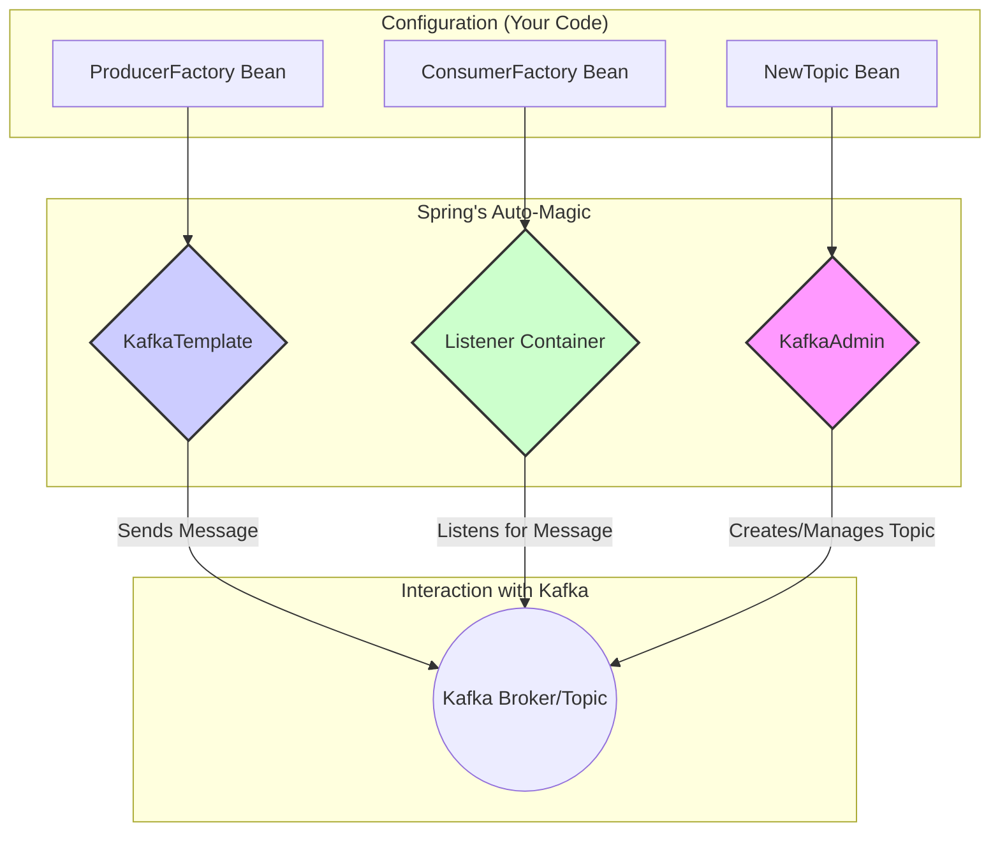

# Spring Kafka: Zero to Hero - 01b: The Key Players 🦸‍♂️🦸‍♀️

Namaste mawa! Last section lo manam Spring Kafka enduku vaadalo thelusukunnam. Ippudu, ee aata lo unna main characters (components) evaro parichayam cheskundam. Ee mugguru chala important, so jaagratthaga vinandi.

---

### 1. `KafkaAdmin`: The Manager 👨‍💼

*   **Component Type**: **Bean** (of class `org.springframework.kafka.core.KafkaAdmin`)

Veedu mana team manager lantodu. Asalu pani cheyadu, kani antha set chesi pedathadu. 😉
*   **Pani enti?**: Mana application start avvagane, velli Kafka broker tho matladi, manaki kaavalsina topics unnayo levo check chestadu. Lekapothe, create chestadu. Ee process ni **idempotent** antaru, ante, topic already unte, idi emi cheyadu, error ivvadu.
*   **Ela vaadali?**: Manam just `NewTopic` ane beans ni create chesi Spring ki isthe chalu, ee `KafkaAdmin` vaatini theeskuni velli broker lo topics create chesestadu. Spring Boot lo idi auto-configured, so manam peddaga tension padalsina avasaram ledu.

### 2. `KafkaTemplate`: The Delivery Boy 🚀

*   **Component Type**: **Class** (`org.springframework.kafka.core.KafkaTemplate`) configured as a **Bean**.

Veedu mana producer ki oka super-hero sidekick lantodu. Messages pampadam veedi pani.
*   **Pani enti?**: Idi standard Kafka `Producer` ni wrap chesi, manaki chala convenient methods istundi. Manam pampali anukuntunna message ni theeskuni, daanini sarigga serialize chesi, Kafka topic lo jaagrathaga padesi vastadu. Idi thread-safe kuda!
*   **Ela vaadali?**: Manam just `kafkaTemplate.send("my-topic", "my-message")` ani call cheste chalu. Antha pani ade chuskuntundi.

### 3. `@KafkaListener`: The Watcher 🕵️‍♀️

*   **Component Type**: **Annotation** (`org.springframework.kafka.annotation.KafkaListener`)

Ee annotation oka super-power lantiది. Idi oka method meeda pedithe, aa method ni oka **Message-Driven POJO** ga convert chestundi. Ante, aa method Kafka messages tho "drive" avthundi.
*   **Pani enti?**: Topic loki kotha message రాగానే, ee "watcher" daanini pattukuni, manam రాసిన method ki istundi.
*   **Ela vaadali?**: Oka simple method create chesi, daani meeda `@KafkaListener(topics = "my-topic")` ani raasthe chalu. Anthe, magic! ✨

---

### How They Work Together: A Simple Diagram 📊

Ee mugguru kalisi ela pani chestaro oka chinna diagram lo chuddam.

Ee diagram lo, manam Factories and Topic blueprints define chestam. Spring vaatini theeskuni `KafkaTemplate`, `Listener Container`, and `KafkaAdmin` lanti powerful components ni create chesi, Kafka tho matladisthundi.

---

### Next Enti? (What's Next?)

Okay mawa, mana key players evaro thelisipoyaru. Ippudu veellani pani cheyinchali ante, manam vaallaki konni rules and settings cheppali. Deenine **Configuration** antaru.

Next section lo, manam producer and consumer ki కావలసిన configuration ni step-by-step ela set cheyalo nerchukundam. Get ready to get your hands dirty with some code! 💻