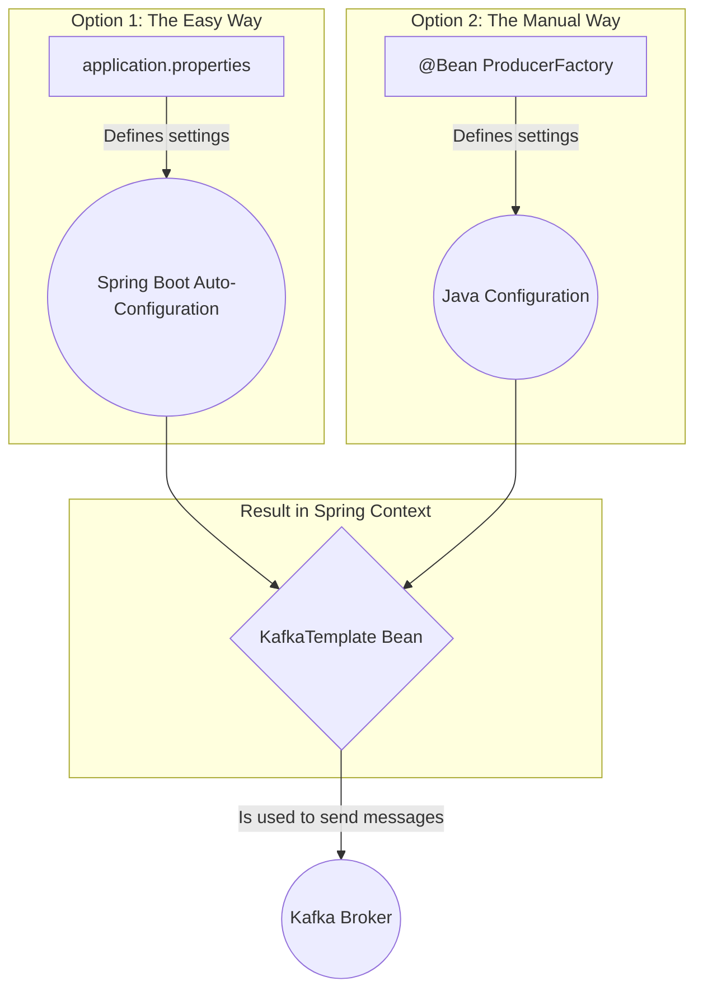

# Spring Kafka: Zero to Hero - 02a: Producer ni Ready Cheddam! 🛠️

Namaste mawa! Last section lo manam key players evaro chusam. Ippudu vaallani pani cheyinchadaniki కావలసిన settings (configuration) ela cheyalo nerchukundam.

First, manam message pampali ante, manaki oka **Producer** kavali. Ee producer ni ready cheyadaniki, manam rendu beans ni create cheyali: `ProducerFactory` and `KafkaTemplate`.

---

### The Components Explained

#### 1. `ProducerFactory`: The Blueprint Maker 🏭
*   **Component Type**: **Interface** (`org.springframework.kafka.core.ProducerFactory`)
*   **Implementation**: `org.springframework.kafka.core.DefaultKafkaProducerFactory`

`ProducerFactory` anedi producer instances ni ela create cheyalo cheppe oka blueprint. Deenilo manam chala important settings define chestam.
*   **`bootstrap.servers`**: Mana Kafka broker (server) ekkada undi? Daaniki address ivvali.
*   **Serializers**: Manam pampali anukunna message (key and value) ni network lo pampadaniki byte stream ga ela marchali? Ee pani serializers chuskuntai. Simple strings pampali ante, `StringSerializer` vaadatham.

#### 2. `KafkaTemplate`: The Worker Bee 🐝
*   **Component Type**: **Class** (`org.springframework.kafka.core.KafkaTemplate`)

Ee `ProducerFactory` blueprint ni theeskuni, `KafkaTemplate` asalu pani chestundi. Idi producer instances ni manage chesi, manaki `send()` ane oka simple method istundi. Manam ee method call cheste, adi velli message ni topic lo padesthundi.

---

### Method 1: The Spring Boot Way (Recommended & Easy) 🚀

Spring Boot tho pani cheyadam chala easy. Manam Java config beans create cheyanakkarledu. Just `src/main/resources/application.properties` file lo ee lines add cheste chalu:

```properties
# Kafka Broker address
spring.kafka.producer.bootstrap-servers=localhost:9092

# Key and Value Serializer classes
spring.kafka.producer.key-serializer=org.apache.kafka.common.serialization.StringSerializer
spring.kafka.producer.value-serializer=org.apache.kafka.common.serialization.StringSerializer
```
Anthe! Ee properties chusi, Spring Boot automatic ga background lo `ProducerFactory` and `KafkaTemplate` beans ni create chesestundi. Manam direct ga mana service lo `KafkaTemplate` ni `@Autowired` cheskovachu.

### Method 2: The Manual Java Configuration Way ☕

Oka vela manaki inka ekkuva control kavali, or manam Spring Boot vaadakapothe, appudu manam ee beans ni manually create cheyali.

Ee code ni `config` package lo `KafkaProducerConfig.java` ane file lo pettuko.

```java
package com.example.config;

import org.apache.kafka.clients.producer.ProducerConfig;
import org.apache.kafka.common.serialization.StringSerializer;
import org.springframework.context.annotation.Bean;
import org.springframework.context.annotation.Configuration;
import org.springframework.kafka.core.DefaultKafkaProducerFactory;
import org.springframework.kafka.core.KafkaTemplate;
import org.springframework.kafka.core.ProducerFactory;

import java.util.HashMap;
import java.util.Map;

@Configuration
public class KafkaProducerConfig {

    @Bean
    public ProducerFactory<String, String> producerFactory() {
        Map<String, Object> configProps = new HashMap<>();
        configProps.put(ProducerConfig.BOOTSTRAP_SERVERS_CONFIG, "localhost:9092");
        configProps.put(ProducerConfig.KEY_SERIALIZER_CLASS_CONFIG, StringSerializer.class);
        configProps.put(ProducerConfig.VALUE_SERIALIZER_CLASS_CONFIG, StringSerializer.class);
        return new DefaultKafkaProducerFactory<>(configProps);
    }

    @Bean
    public KafkaTemplate<String, String> kafkaTemplate() {
        return new KafkaTemplate<>(producerFactory());
    }
}
```

### Diagram: Configuration Flow ⚙️



---

### 📝 Interview Point:

"**How do you configure a Kafka Producer in a Spring Boot application?**"
"The simplest way is through `application.properties`. We can set properties like `spring.kafka.producer.bootstrap-servers` and the key/value serializers. Spring Boot's auto-configuration will use these to create the `ProducerFactory` and `KafkaTemplate` beans for us. For more advanced or dynamic configurations, we can define our own `ProducerFactory` and `KafkaTemplate` `@Bean`s in a `@Configuration` class."

---

### Next Enti? (What's Next?)

Producer ni ready chesam. Ippudu consumer side ki kuda ilane configuration cheyali ga?

Next section lo, manam `ConsumerFactory` and `ConcurrentKafkaListenerContainerFactory` beans ni ela configure cheyalo chuddam. Appude manam pampina messages ni receive cheskovadaniki ready avtham! Let's go! 🚀