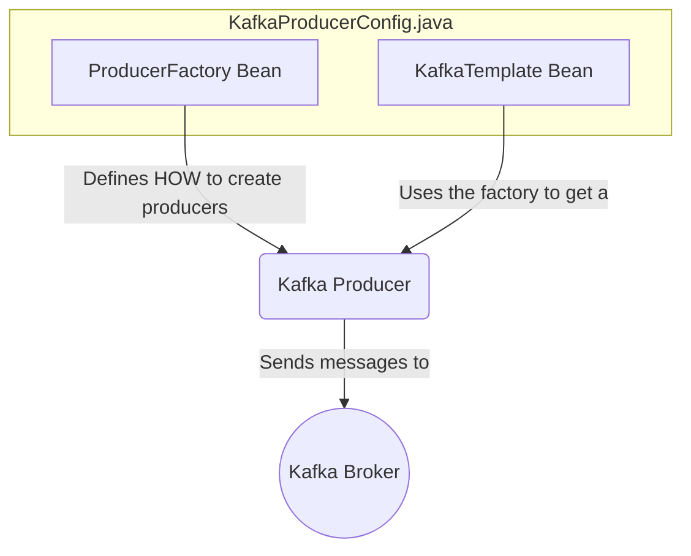

# Spring Kafka: Zero to Hero - 02a: Producer ni Ready Cheddam! 🛠️

Namaste mawa! Last section lo manam key players evaro chusam. Ippudu vaallani pani cheyinchadaniki కావలసిన settings (configuration) ela cheyalo nerchukundam.

First, manam message pampali ante, manaki oka **Producer** kavali. Ee producer ni ready cheyadaniki, manam rendu beans ni create cheyali: `ProducerFactory` and `KafkaTemplate`.

---

### 1. `ProducerFactory`: The Blueprint Maker 🏭

`ProducerFactory` anedi producer instances ni ela create cheyalo cheppe oka blueprint. Deenilo manam chala important settings define chestam.

*   **`bootstrap.servers`**: Mana Kafka broker (server) ekkada undi? Daaniki address ivvali.
*   **Serializers**: Manam pampali anukunna message (key and value) ni network lo pampadaniki byte stream ga ela marchali? Ee pani serializers chuskuntai. Simple strings pampali ante, `StringSerializer` vaadatham.

### 2. `KafkaTemplate`: The Worker Bee 🐝

Ee `ProducerFactory` blueprint ni theeskuni, `KafkaTemplate` asalu pani chestundi. Idi producer instances ni manage chesi, manaki `send()` ane oka simple method istundi. Manam ee method call cheste, adi velli message ni topic lo padesthundi.

---

### Java-Based Configuration ☕

Spring Boot lo, ee beans ni manam oka `@Configuration` class lo define chestam. Ee code ni copy chesi, mee project lo `config` ane package create chesi andulo `KafkaProducerConfig.java` ane file lo pettuko.

```java
package com.example.config;

import org.apache.kafka.clients.producer.ProducerConfig;
import org.apache.kafka.common.serialization.StringSerializer;
import org.springframework.context.annotation.Bean;
import org.springframework.context.annotation.Configuration;
import org.springframework.kafka.core.DefaultKafkaProducerFactory;
import org.springframework.kafka.core.KafkaTemplate;
import org.springframework.kafka.core.ProducerFactory;

import java.util.HashMap;
import java.util.Map;

@Configuration
public class KafkaProducerConfig {

    @Bean
    public ProducerFactory<String, String> producerFactory() {
        Map<String, Object> configProps = new HashMap<>();

        // Kafka Broker address
        configProps.put(ProducerConfig.BOOTSTRAP_SERVERS_CONFIG, "localhost:9092");

        // Key and Value Serializer classes
        configProps.put(ProducerConfig.KEY_SERIALIZER_CLASS_CONFIG, StringSerializer.class);
        configProps.put(ProducerConfig.VALUE_SERIALIZER_CLASS_CONFIG, StringSerializer.class);

        return new DefaultKafkaProducerFactory<>(configProps);
    }

    @Bean
    public KafkaTemplate<String, String> kafkaTemplate() {
        return new KafkaTemplate<>(producerFactory());
    }
}
```

### Diagram: Configuration Flow ⚙️



---

### 📝 Interview Point:

"**What are the minimum properties required to configure a Kafka Producer in Spring?**"
"The absolute minimum properties are:
1.  `bootstrap.servers`: To tell the client where the Kafka cluster is.
2.  `key.serializer`: To define how the message key should be converted to bytes.
3.  `value.serializer`: To define how the message value should be converted to bytes.
Spring Kafka wraps this configuration in `ProducerFactory` and `KafkaTemplate` beans."

---

### Next Enti? (What's Next?)

Producer ni ready chesam. Ippudu consumer side ki kuda ilane configuration cheyali ga?

Next section lo, manam `ConsumerFactory` and `ConcurrentKafkaListenerContainerFactory` beans ni ela configure cheyalo chuddam. Appude manam pampina messages ni receive cheskovadaniki ready avtham! Let's go! 🚀