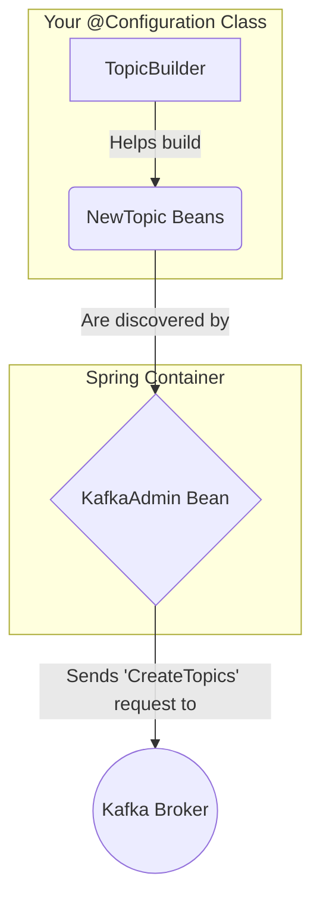

# Spring Kafka: Zero to Hero - 02c: Topics ni Code tho Create Cheddam! 🏗️

Namaste mawa! Manam ippativaraku topics unnayi ani anukuni messages pampam, receive cheskunnam. Kani, oka kotha environment lo mana application deploy chesinappudu, aa topic mundu nunchi create chesi undakapothe? Appudu mana application start avvagane fail avthundi. 🤯

Ee problem ni solve cheyadaniki, maname mana application start ayyetappudu కావలసిన topics ni create cheyochu. "Topic unda leda ani check chey, lekapothe create chey" ani manam Spring ki cheppochu.

---

### Key Players: Ee Aata lo Iddaroo Pedda Thalaakaayalu! 👑

1.  **`KafkaAdmin` (The Manager 👨‍💼)**
    *   **Component Type**: **Bean** (`org.springframework.kafka.core.KafkaAdmin`)
    *   **Pani enti?**: Mana application context lo ee bean unte, adi velli Kafka broker tho matladi, topics create cheyadam, modify cheyadam lanti panulu chuskuntundi. Spring Boot lo idi auto-configured, so manam peddaga tension padalsina avasaram ledu.

2.  **`NewTopic` (The Blueprint 📜)**
    *   **Component Type**: **Class** (`org.apache.kafka.clients.admin.NewTopic`)
    *   **Pani enti?**: Idi oka blueprint anamata. Manam create cheyali anukuntunna topic ki ela undali—ante topic peru enti, enni partitions undali, enni replicas undali, vere configurations emaina unnaya—lanti details anni ee class object lo define chestam.

Application start ayinappudu, `KafkaAdmin` mana context lo unna `NewTopic` beans anni theeskuni, Kafka broker lo aa topics ni create chestundi.

---

### Configuration: Topic ni Ela Create Cheyali? 🔨

Manam `NewTopic` beans ni create cheyadaniki `TopicBuilder` ane oka convenient "helper" class ni vaadatham. Idi manaki code ni chala clean ga raayadaniki help chestundi (fluent API).

**Method 1: Separate Beans for Each Topic**

```java
package com.example.config;

import org.apache.kafka.clients.admin.NewTopic;
import org.apache.kafka.common.config.TopicConfig;
import org.springframework.context.annotation.Bean;
import org.springframework.context.annotation.Configuration;
import org.springframework.kafka.config.TopicBuilder;

@Configuration
public class KafkaTopicConfig {

    @Bean
    public NewTopic myFirstTopic() {
        return TopicBuilder.name("my-first-topic")
                .partitions(3)    // 3 partitions create chey
                .replicas(1)      // 1 replica undali (dev environment lo 1 saalu)
                .build();
    }

    @Bean
    public NewTopic myCompactedTopic() {
        return TopicBuilder.name("my-compacted-topic")
                .partitions(1)
                .replicas(1)
                .config(TopicConfig.CLEANUP_POLICY_CONFIG, TopicConfig.CLEANUP_POLICY_COMPACT) // Topic config set chey
                .build();
    }
}
```

**Method 2: Single Bean for Multiple Topics (More Efficient)**
Oka vela manam chala topics create cheyali anukunte, prathi daaniki oka `@Bean` method rayadam badulu, `KafkaAdmin.NewTopics` ane helper class ni vaadochu.

```java
// In KafkaTopicConfig.java

@Configuration
public class KafkaTopicConfig {

    @Bean
    public KafkaAdmin.NewTopics allTopics() {
        return new KafkaAdmin.NewTopics(
            TopicBuilder.name("my-first-topic").partitions(3).replicas(1).build(),
            TopicBuilder.name("my-second-topic").partitions(5).replicas(1).build(),
            TopicBuilder.name("my-compacted-topic").config(TopicConfig.CLEANUP_POLICY_CONFIG, TopicConfig.CLEANUP_POLICY_COMPACT).build()
        );
    }
}
```

### Diagram: The Auto-Creation Flow ✨



---

### 📝 Interview Point:

"**How do you programmatically create multiple topics on startup in a Spring Boot application?**"
"The most efficient way is to define a single `@Bean` of type `KafkaAdmin.NewTopics`. This bean's constructor can take multiple `NewTopic` objects as arguments. We can use the `TopicBuilder` fluent API to easily construct each `NewTopic` with its specific name, partition count, replica factor, and other configurations. When the application starts, the auto-configured `KafkaAdmin` bean finds this single `NewTopics` bean and creates all the defined topics in one go."

---

### Next Enti? (What's Next?)

Super mawa! Configuration section antha cover chesam. Producer ready, Consumer ready, and Topic kuda ready. Ippudu asalu pani modaledadam.

Next section lo, manam mana `KafkaTemplate` ni use chesi, mana modati message ni ela pampalo chuddam. Let's start sending some data! 📤