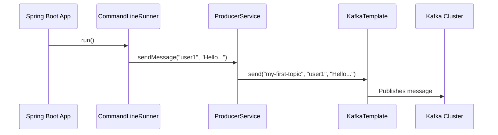

# Spring Kafka: Zero to Hero - 03a: Modati Message Pampaala! 📤

Namaste mawa! Anni configurations set chesam. Ippudu asalu time vachindi—mana modati message ni Kafka topic loki pampadaniki!

Manam ee pani cheyadaniki `KafkaTemplate` ane mana super-hero ni vaadatham. 🦸‍♂️

---

### Using the `KafkaTemplate`

`KafkaTemplate` ni use cheyadam chala simple.
1.  Oka Service class create chey.
2.  `@Autowired` tho `KafkaTemplate` ni inject chesko.
3.  `kafkaTemplate.send()` method ni call chey. Anthe!

`send()` method lo chala variations (overloads) unnayi:
*   `send(topic, value)`: Simple ga oka message ni pampadaniki.
*   `send(topic, key, value)`: Oka **key** tho paatu message pampadaniki. Key ivvadam valla, aa key unna messages anni oke partition loki velthai (by default). Idi ordering guarantee cheyadaniki chala important.
*   `send(topic, partition, key, value)`: Maname specific ga ఏ partition ki pampalo cheppadaniki.
*   `send(ProducerRecord record)`: Anni details (topic, partition, key, value, headers) unna oka `ProducerRecord` object ni pampadaniki.

### Let's Write Some Code! 💻

Ee code ni copy chesi, mee project lo `service` package lo `MessageProducerService.java` ane file lo pettuko.

```java
package com.example.service;

import org.springframework.beans.factory.annotation.Autowired;
import org.springframework.kafka.core.KafkaTemplate;
import org.springframework.stereotype.Service;

@Service
public class MessageProducerService {

    private static final String TOPIC = "my-first-topic";

    @Autowired
    private KafkaTemplate<String, String> kafkaTemplate;

    public void sendMessage(String key, String message) {
        System.out.println(String.format("#### -> Producing message -> Key: %s, Value: %s", key, message));

        // The magic happens here! ✨
        // We are sending a key along with the message.
        this.kafkaTemplate.send(TOPIC, key, message);
    }
}
```

### How to Run and Test This?

Ee service ni call cheyadaniki, manam oka `CommandLineRunner` create cheddam. Idi application start avvagane automatic ga run avthundi. Ee code ni mee main application file lo pettuko.

```java
// In your main Spring Boot Application class

@SpringBootApplication
public class MyKafkaApplication {

    public static void main(String[] args) {
        SpringApplication.run(MyKafkaApplication.class, args);
    }

    // This bean will run on startup
    @Bean
    public CommandLineRunner commandLineRunner(MessageProducerService producerService) {
        return args -> {
            System.out.println("---- Sending messages ----");
            producerService.sendMessage("user1", "Hello User 1!");
            producerService.sendMessage("user2", "Hello User 2!");
            producerService.sendMessage("user1", "Welcome back, User 1!");
        };
    }
}
```
Ippudu application run cheste, ee 3 messages produce avthayi. `user1` key unna rendu messages oke partition loki velthai!

### Diagram: Message Sending Flow ➡️



---

### 📝 Interview Point:

"**Which Spring Kafka class simplifies sending messages, and how do you ensure messages with the same business key go to the same partition?**"
"The **`KafkaTemplate`** class simplifies message sending. To ensure messages with the same business key (like a user ID) go to the same partition for ordering purposes, we should use the `send(topic, key, value)` method overload. Kafka's default partitioner will use a hash of the key to consistently choose the same partition for that key, thus guaranteeing the order of messages for that specific key."

---

### Next Enti? (What's Next?)

Mawa, manam `send()` method call chesam, kani asalu aa message broker ki vellinda, leda? Success ayyinda, fail ayyinda? Ee details manaki teliyali kada?

By default, `send()` anedi **asynchronous**. Ante, adi message ni pampi, result kosam wait cheyadu. Aa result ni manam ela handle cheyalo, next section lo chuddam. Get ready for **Async Send and Callbacks**! 🔥