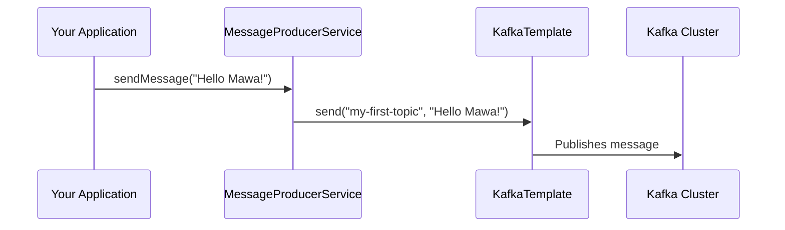

# Spring Kafka: Zero to Hero - 03a: Modati Message Pampaala! 📤

Namaste mawa! Anni configurations set chesam. Ippudu asalu time vachindi—mana modati message ni Kafka topic loki pampadaniki!

Manam ee pani cheyadaniki `KafkaTemplate` ane mana super-hero ni vaadatham. 🦸‍♂️

---

### Message Pampaala! (Let's Send a Message!)

`KafkaTemplate` ni use cheyadam chala simple.
1.  Oka Service class create chey.
2.  `@Autowired` tho `KafkaTemplate` ni inject chesko.
3.  `kafkaTemplate.send()` method ni call chey. Anthe!

Ee code ni copy chesi, mee project lo `service` ane package create chesi andulo `MessageProducerService.java` ane file lo pettuko.

```java
package com.example.service;

import org.springframework.beans.factory.annotation.Autowired;
import org.springframework.kafka.core.KafkaTemplate;
import org.springframework.stereotype.Service;

@Service
public class MessageProducerService {

    private static final String TOPIC = "my-first-topic";

    @Autowired
    private KafkaTemplate<String, String> kafkaTemplate;

    public void sendMessage(String message) {
        System.out.println(String.format("#### -> Producing message -> %s", message));

        // The magic happens here! ✨
        this.kafkaTemplate.send(TOPIC, message);
    }
}
```

**Code lo em undi?**
*   `@Service`: Idi oka Spring service bean ani cheptunnam.
*   `@Autowired`: Spring, please naaku `KafkaTemplate` bean ni ivvu ani adugutunnam.
*   `kafkaTemplate.send(TOPIC, message)`: Ee okka line chaalu, message ni `my-first-topic` ane topic loki pampadaniki.

Ippudu ee service ni manam `RestController` or `CommandLineRunner` nunchi call chesi, message pampochu.

---

### Diagram: Message Sending Flow ➡️


Ee diagram lo chusthe, mana application nunchi message ela Kafka cluster ki velthundo clear ga artham avthundi.

---

### 📝 Interview Point:

"**Which Spring Kafka class simplifies sending messages to a topic?**"
"The **`KafkaTemplate`** class. It wraps the standard Kafka `Producer` and provides convenient methods to send messages. It handles all the low-level details like managing producer instances and connections, allowing developers to send messages with a single method call."

---

### Next Enti? (What's Next?)

Mawa, manam `send()` method call chesam, kani asalu aa message broker ki vellinda, leda? Success ayyinda, fail ayyinda? Ee details manaki teliyali kada?

By default, `send()` anedi **asynchronous**. Ante, adi message ni pampi, result kosam wait cheyadu. Next line execute chesestundi. Aa result ni manam ela handle cheyalo, next section lo chuddam. Get ready for **Async Send and Callbacks**! 🔥