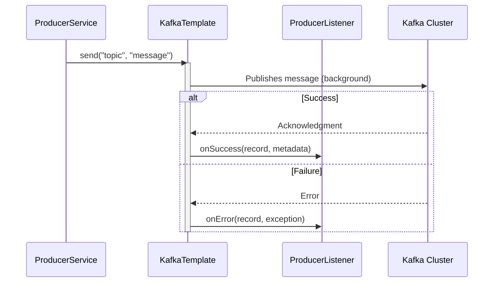

# Spring Kafka: Zero to Hero - 03b: Message Vellinda? Leda? (Async Send & Callbacks) 🤔

Namaste mawa! Last section lo manam `kafkaTemplate.send()` tho message pampam. Kani, nenu cheppinattu, aa operation **asynchronous**. Ante, adi message ni pampi, result (success or failure) kosam wait cheyadu. Appudu, manaki message broker ki cherindo ledo ela telustundi?

Ikkada manaki rendu main approaches unnayi.

---

### Method 1: Handling `CompletableFuture` Directly

`kafkaTemplate.send()` method manaki `CompletableFuture<SendResult<String, String>>` ane oka object ni return chestundi. Idi oka promise lantiది: "Mawa, nenu message ni pampadaniki try chestunna. Pani aipoyaka, result ento neeku ee 'Future' object lo cheptha."

Manam aa "Future" object ki oka **callback** ni `.whenComplete()` tho attach cheyochu.

*   **`result` (`SendResult`)**: Message successfully vellinte, ee object lo `ProducerRecord` (manam pampina original record) and `RecordMetadata` (topic, partition, offset lanti details) untai.
*   **`ex` (`Exception`)**: Message fail aithe, ee object lo enduku fail ayyindo reason untundi.

**Producer Service Update (`MessageProducerService.java`):**

```java
// In MessageProducerService.java
import org.springframework.kafka.support.SendResult;
import java.util.concurrent.CompletableFuture;

@Service
public class MessageProducerService {
    // ...
    public void sendMessageWithCallback(String message) {
        CompletableFuture<SendResult<String, String>> future = this.kafkaTemplate.send("my-first-topic", message);

        future.whenComplete((result, ex) -> {
            if (ex == null) {
                System.out.println("✅ Sent message=[" + message +
                                   "] with offset=[" + result.getRecordMetadata().offset() + "]");
            } else {
                System.out.println("❌ Unable to send message=[" + message + "] due to : " + ex.getMessage());
            }
        });
    }
}
```

---

### Method 2: Using a `ProducerListener` (The Reusable Way) ♻️

Prathi `send()` call ki `.whenComplete()` raayadam konchem repetitive ga undochu. Inko clean approach enti ante, `KafkaTemplate` ki oka **`ProducerListener`** ni set cheyadam.

`ProducerListener` anedi oka **Interface**. Manam deenini implement chesi, `onSuccess` and `onError` methods lo mana logic raayochu. Appudu, `KafkaTemplate` pampina prathi message ki, result batti, ee methods automatic ga call avthai.

**Step 1: Create a Custom ProducerListener Bean**

```java
package com.example.listener;

import org.apache.kafka.clients.producer.ProducerRecord;
import org.apache.kafka.clients.producer.RecordMetadata;
import org.springframework.kafka.support.ProducerListener;
import org.springframework.stereotype.Component;

@Component
public class MyProducerListener implements ProducerListener<String, String> {

    @Override
    public void onSuccess(ProducerRecord<String, String> producerRecord, RecordMetadata recordMetadata) {
        System.out.println("✅ ACK from ProducerListener: message " + producerRecord.value() + " sent to topic " + recordMetadata.topic());
    }

    @Override
    public void onError(ProducerRecord<String, String> producerRecord, RecordMetadata recordMetadata, Exception exception) {
        System.err.println("❌ ERROR from ProducerListener: Failed to send message " + producerRecord.value() + " due to " + exception.getMessage());
    }
}
```

**Step 2: Configure the Listener on KafkaTemplate**

```java
// In KafkaProducerConfig.java
import org.springframework.kafka.support.ProducerListener;

@Configuration
public class KafkaProducerConfig {
    // ... producerFactory() bean ...

    @Bean
    public KafkaTemplate<String, String> kafkaTemplate(ProducerFactory<String, String> producerFactory,
                                                       ProducerListener<String, String> myProducerListener) {
        KafkaTemplate<String, String> kafkaTemplate = new KafkaTemplate<>(producerFactory);
        // KafkaTemplate ki mana custom listener ni set cheddam
        kafkaTemplate.setProducerListener(myProducerListener);
        return kafkaTemplate;
    }
}
```
Ippudu, manam `kafkaTemplate.send()` ni ekkada call chesina, ee listener automatic ga handle cheskuntundi!

### Diagram: ProducerListener Flow 🔄



---

### 📝 Interview Point:

"**What are the ways to handle the result of a `kafkaTemplate.send()` operation?**"
"There are two primary ways:
1.  **Using `CompletableFuture`**: The `send()` method returns a `CompletableFuture`. We can attach a callback to it using `.whenComplete()` to handle success and failure asynchronously for that specific send call.
2.  **Using `ProducerListener`**: For a more centralized approach, we can implement the `ProducerListener` interface and define `onSuccess` and `onError` logic. This listener bean is then configured on the `KafkaTemplate`. It gets invoked for every message sent through that template, which is great for common logic like logging."

---

### Next Enti? (What's Next?)

Super! Ippudu manaki message status kuda telustondi. Kani, manam message tho paatu konchem extra information (metadata) pampali anukunte ela? For example, oka trace ID or source system name.

Next section lo, manam **Kafka Headers** ni use chesi, message tho paatu metadata ni ela pampalo nerchukundam. Adi chala useful feature! Let's go! 🏷️