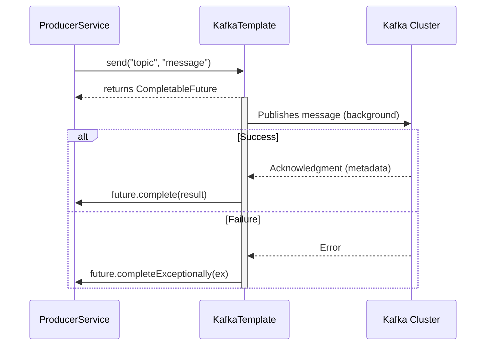

# Spring Kafka: Zero to Hero - 03b: Message Vellinda? Leda? (Async Send & Callbacks) 🤔

Namaste mawa! Last section lo manam `kafkaTemplate.send()` tho message pampam. Kani, nenu cheppinattu, aa operation **asynchronous**. Ante, adi message ni pampi, result (success or failure) kosam wait cheyadu. Appudu, manaki message broker ki cherindo ledo ela telustundi?

Ikkade manaki `CompletableFuture` ane concept parichayam avthundi.

---

### `CompletableFuture`: The Promise of a Result 🤝

`kafkaTemplate.send()` method manaki `CompletableFuture<SendResult<String, String>>` ane oka object ni return chestundi. Idi oka promise lantiది: "Mawa, nenu message ni pampadaniki try chestunna. Pani aipoyaka, result ento neeku ee 'Future' object lo cheptha."

Manam aa "Future" object ki oka **callback** ni attach cheyochu. Ante, "Nee pani aipoyaka, ee code ni run chey" ani cheppadam.

### Callback ni Ela Attach Cheyali?

`CompletableFuture` meeda `.whenComplete()` ane method untundi. Deeniki manam oka lambda function ni istham. Ee function lo manaki `result` and `exception` ane rendu parameters vastai.

*   **`result`**: Message successfully vellinte, ee object lo topic, partition, offset lanti details untai.
*   **`exception`**: Message fail aithe, ee object lo enduku fail ayyindo reason untundi.

**Producer Service Update (`MessageProducerService.java`):**

```java
package com.example.service;

import org.springframework.beans.factory.annotation.Autowired;
import org.springframework.kafka.core.KafkaTemplate;
import org.springframework.kafka.support.SendResult;
import org.springframework.stereotype.Service;
import java.util.concurrent.CompletableFuture;

@Service
public class MessageProducerService {

    private static final String TOPIC = "my-first-topic";

    @Autowired
    private KafkaTemplate<String, String> kafkaTemplate;

    public void sendMessageWithCallback(String message) {
        System.out.println(String.format("#### -> Producing message -> %s", message));

        CompletableFuture<SendResult<String, String>> future = this.kafkaTemplate.send(TOPIC, message);

        future.whenComplete((result, ex) -> {
            if (ex == null) {
                // Success! ✅
                System.out.println("Sent message=[" + message +
                                   "] with offset=[" + result.getRecordMetadata().offset() + "]");
            } else {
                // Failure! ❌
                System.out.println("Unable to send message=[" +
                                   message + "] due to : " + ex.getMessage());
            }
        });
    }
}
```

---

### Diagram: Async Flow with Callback 🔄


Ee diagram lo, `KafkaTemplate` manaki ventane oka `CompletableFuture` ichestundi. Tarvata background lo message pampi, result vachaka aa future ni update chestundi.

---

### 📝 Interview Point:

"**How do you get the result of a `kafkaTemplate.send()` operation?**"
"The `send()` method returns a `CompletableFuture<SendResult>`. Since the operation is asynchronous, we should not call `.get()` on the future as it would block the thread. The recommended approach is to attach a callback using the `.whenComplete()` method. This allows us to handle both success and failure outcomes asynchronously without blocking the application."

---

### Next Enti? (What's Next?)

Super! Ippudu manaki message status kuda telustondi. Kani, manam message tho paatu konchem extra information (metadata) pampali anukunte ela? For example, oka trace ID or source system name.

Next section lo, manam **Kafka Headers** ni use chesi, message tho paatu metadata ni ela pampalo nerchukundam. Adi chala useful feature! Let's go! 🏷️