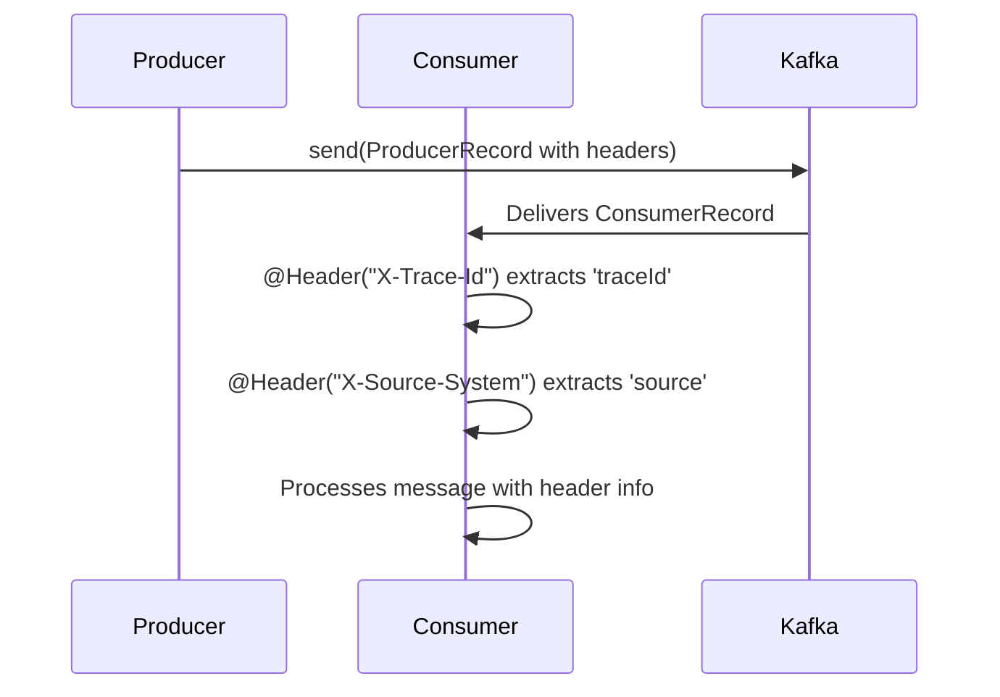

# Spring Kafka: Zero to Hero - 03c: Message ki Metadata Add Cheddam (Kafka Headers) 🏷️

Namaste mawa! Manam ippudu message payload (ante asalu content) tho ela pani cheyalo chusam. Kani konni sarlu, manaki message tho paatu konchem extra information pampali anipistundi. Ee extra information ni **Headers** lo pedatam.

Headers anevi key-value pairs anamata, kani ivi message content lo kalavavu. Separate ga untai.

### Enduku vaadali ee headers? 🤔
*   **Tracing**: Oka message ఏ service nunchi vachindi, daani trace ID enti lanti information pettukovachu.
*   **Routing**: Header lo unna value batti, aa message ni ela process cheyalo decide avvochu.
*   **Versioning**: Message format version ento header lo pampochu.

---

### Step 1: Headers Ela Pampaali? (Sending Headers) 📤

`KafkaTemplate` tho message pampetappudu headers add cheyadam chala easy. Manam `ProducerRecord` ane **Class** ni create chesi, daaniki headers ni add cheyali.

**Producer Service Update (`MessageProducerService.java`):**

```java
package com.example.service;

import org.apache.kafka.clients.producer.ProducerRecord;
import org.springframework.beans.factory.annotation.Autowired;
import org.springframework.kafka.core.KafkaTemplate;
import org.springframework.stereotype.Service;

@Service
public class MessageProducerService {

    private static final String TOPIC = "my-header-topic";

    @Autowired
    private KafkaTemplate<String, String> kafkaTemplate;

    public void sendMessageWithHeaders(String message, String traceId) {
        System.out.println(String.format("#### -> Producing message with traceId %s -> %s", traceId, message));

        // 1. Create a ProducerRecord
        ProducerRecord<String, String> record = new ProducerRecord<>(TOPIC, message);

        // 2. Add headers
        record.headers().add("X-Trace-Id", traceId.getBytes());
        record.headers().add("X-Source-System", "OrderService".getBytes());

        // 3. Send the record
        this.kafkaTemplate.send(record);
    }
}
```
Ikkada `X-Trace-Id` and `X-Source-System` anevi manam pampina extra information (metadata). Note chesko, header values `byte[]` format lo pampaali.

---

### Step 2: Headers Ela Chadavaali? (Reading Headers) 📥

Listener side lo headers ni chadavaali ante, manam method signature lo `@Header` ane **Annotation** ni use cheyali. Spring Kafka manaki chala built-in header names `KafkaHeaders` aney class lo istundi, kani manam custom headers ni kuda easy ga chadavochu.

**Consumer Service Update (`MessageConsumerService.java`):**

```java
package com.example.service;

import org.springframework.kafka.annotation.KafkaListener;
import org.springframework.messaging.handler.annotation.Header;
import org.springframework.kafka.support.KafkaHeaders;
import org.springframework.stereotype.Service;

@Service
public class MessageConsumerService {

    @KafkaListener(topics = "my-header-topic", groupId = "header-group")
    public void listenWithHeaders(
            String message,
            @Header(KafkaHeaders.RECEIVED_TOPIC) String topic,
            @Header(KafkaHeaders.RECEIVED_KEY) String key,
            @Header("X-Trace-Id") String traceId,
            @Header("X-Source-System") String source) {

        System.out.println("#### -> Consumed message from topic: " + topic);
        System.out.println("#### -> Key: " + key + ", Value: " + message);
        System.out.println("#### -> Trace ID: " + traceId);
        System.out.println("#### -> Source System: " + source);
    }
}
```

### Diagram: End-to-End Header Flow 🏷️➡️📬



---

### 📝 Interview Point:

"**How can you pass metadata along with a Kafka message without altering the payload?**"
"The best way is by using **Kafka Headers**. We can add custom headers to the `ProducerRecord` object before sending it with `KafkaTemplate`. On the consumer side, we can easily access these headers in our `@KafkaListener` method by using the `@Header` annotation with the specific header name. This is a clean and standard way to pass cross-cutting information like trace IDs or source system details."

---

### Next Enti? (What's Next?)

Producer side antha cover chesam mawa! 💪 Manam messages pampadam lo pro aipoyam.

Ippudu coin ki maro vaipu chuddam. Asalu ee pampina messages ni ela receive cheskovali? `@KafkaListener` antha powerful enduku? Ee vishayalu anni next section lo, **The Art of Consuming Messages**, lothuga thelusukundam. See you there! 🎧