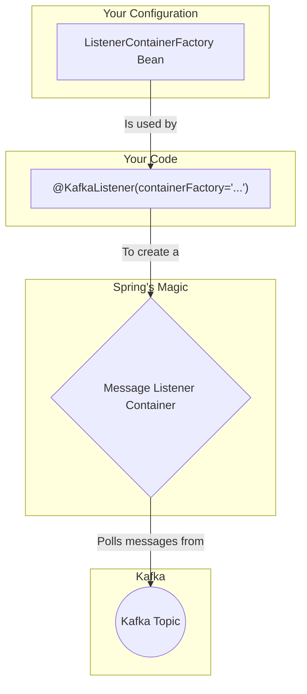

# Spring Kafka: Zero to Hero - 04a: The Power of @KafkaListener 🦸‍♀️

Namaste mawa! Producer side antha chusam. Ippudu asalu magic chuddam. Piles of code rayakunda, just okke okka **Annotation** tho messages ni ela receive cheskovacho chuddam.

Aa super-power annotation pere **`@KafkaListener`**.

---

### `@KafkaListener`: The 24/7 Watcher 🕵️‍♀️

Ee annotation oka method meeda pedithe, Spring Kafka aa method ni oka dedicated "watcher" ga convert chestundi. Ee pattern ni **Message-Driven POJO** (Plain Old Java Object) antaru. Ante, mana simple Java method ippudu Kafka messages tho drive avthundi.

Aa watcher anukshanam (24/7) manam cheppina topic ni gamanistu untundi. Topic loki kotha message రాగానే, ee watcher daanini pattukuni, manam రాసిన method ki istundi.

**Advantages enti?**
*   **Zero Boilerplate**: Manam `consumer.poll()` lanti low-level code rayalsina avasaram ledu.
*   **Automatic**: Antha automatic ga jaruguthundi.
*   **Simple**: Just oka annotation, anthe!

### `@KafkaListener` Key Attributes

Ee annotation lo manam chala properties set cheyochu, kani ivi most important:
*   `id`: Ee listener ki oka unique ID. Idi manaki tarvata listener ni programmatically control (e.g., pause, resume) cheyadaniki use avthundi.
*   `topics`: Ee listener ఏ topic(s) ni vinali anedi ikkada cheptam. Multiple topics ni kuda ivvochu, like `topics = {"topic1", "topic2"}`.
*   `groupId`: Ee listener ఏ consumer group ki chendinaది anedi ikkada cheptam. Idi parallel processing ki chala important.
*   `containerFactory`: Ee listener ni manage chese container ni ఏ factory create cheyalo cheptam. Manam custom factory create cheste, daani bean name ikkada ivvali.

### Basic Usage: A Simple Listener 🎧

Ee code ni copy chesi, mee project lo `service` package lo `MessageConsumerService.java` ane file lo pettuko.

```java
package com.example.service;

import org.springframework.kafka.annotation.KafkaListener;
import org.springframework.stereotype.Service;

@Service
public class MessageConsumerService {

    // Ee annotation chudu, entha simple ga undo!
    @KafkaListener(id = "my-first-listener",
                   topics = "my-first-topic",
                   groupId = "my-group-id",
                   containerFactory = "kafkaListenerContainerFactory") // Manam config lo create chesina factory
    public void listen(String message) {
        System.out.println("#### -> Consumed message -> " + message);
    }
}
```

Anthe mawa! Intha simple ga manam Kafka consumer ni create chesam.

---

### Diagram: The Listener Flow 👂



---

### 📝 Interview Point:

"**How do you consume messages from a Kafka topic in a Spring application?**"
"The simplest and most common way is by using the `@KafkaListener` annotation on a method. This annotation designates the method as a Kafka message listener. We configure it with essential attributes like `id` for identification, `topics` to subscribe to, and a `groupId`. We also specify a `containerFactory` which Spring uses to create the underlying `MessageListenerContainer`. This container handles all the low-level details of polling the consumer and invoking the listener method when a message arrives."

---

### Next Enti? (What's Next?)

Okay, manam ippudu oke saari oka message ni process chestunnam. Kani, manaki high traffic unte? Oke saari vanda messages vasthe? Appudu mana application slow avthundi.

Ee problem ni solve cheyadaniki, manam **Concurrency** ni use chestam. Ante, oke saari multiple threads tho messages ni parallel ga process cheyadam. Ee concept gurinchi next section lo lothuga thelusukundam! 🚀