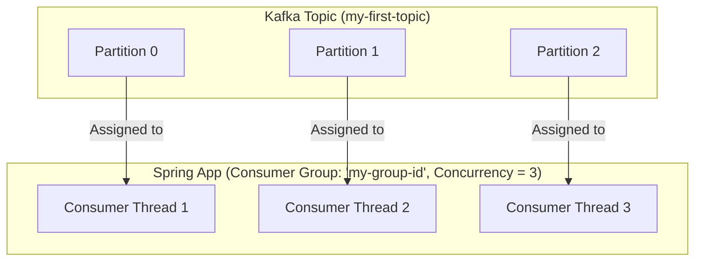

# Spring Kafka: Zero to Hero - 04b: Oke Debba ki Rendu Pittalu! (Concurrency) 🚀

Namaste mawa! Mana listener ippudu prashanthanga, oke thread tho pani chestundi. Kani, real-world lo traffic anedi tsunami 🌊 laaga vachi padutundi. Appudu mana single-threaded listener em avthundi? Slow aipothundi, messages queue lo undipothai.

Ee problem ni solve cheyadaniki, manam multiple threads tho, oke saari multiple messages ni process cheyali. Deenine **Concurrency** antaru.

---

### Concurrency Ela Pani Chestundi?

Kafka lo, concurrency anedi **Partitions** meeda aadharapadi untundi.
*   Oka topic ni manam multiple partitions ga divide cheyochu.
*   Oke consumer group lo, prathi consumer (thread) oka (or konni) partition(s) ki assign avthundi.
*   **The Golden Rule**: Oka partition ni oke saari oke consumer matrame read cheyagaladu (within the same consumer group).

So, manam throughput (message processing speed) penchali ante, rendu panulu cheyali:
1.  Topic ki ekkuva partitions create cheyali.
2.  Mana application lo antha mandi consumers ni (threads ni) create cheyali.

**Important Note**: What if `concurrency > number of partitions`? Appudu, konni consumer threads kaaliga (idle) untai, endukante vaatiki assign cheyadaniki partitions undavu. So, always remember: **`concurrency <= number of partitions`** is the ideal setup for maximum efficiency.

---

### How to Configure Concurrency?

#### Method 1: Setting on the Container Factory (Global Setting)
Mana listener container factory lo `setConcurrency()` method ni call cheddam. Idi aa factory use chese anni listeners ki apply avthundi.

```java
// In KafkaConsumerConfig.java

@Configuration
public class KafkaConsumerConfig {

    // ... consumerFactory() bean ...

    @Bean
    public ConcurrentKafkaListenerContainerFactory<String, String> kafkaListenerContainerFactory() {
        ConcurrentKafkaListenerContainerFactory<String, String> factory = new ConcurrentKafkaListenerContainerFactory<>();
        factory.setConsumerFactory(consumerFactory());

        // Ikkade magic undi! ✨
        factory.setConcurrency(3); // 3 threads create chey ani cheptunnam

        return factory;
    }
}
```

#### Method 2: Setting on the `@KafkaListener` (Specific Override)
Oka vela manaki oka specific listener ki matrame vere concurrency kavali anukunte, manam direct ga annotation meeda ne set cheyochu. Idi factory setting ni override chestundi.

```java
// In MessageConsumerService.java

@Service
public class MessageConsumerService {

    @KafkaListener(id = "my-high-concurrency-listener",
                   topics = "high-traffic-topic",
                   concurrency = "5") // Ee listener ki 5 threads!
    public void listenToHighTraffic(String message) {
        System.out.println("High traffic listener processing message: " + message);
    }
}
```

### Diagram: Concurrency in Action ⚡


Ee diagram lo, manam 3 threads create chesam, and Kafka prathi thread ki oka separate partition ni assign chesindi. Ippudu processing super fast! 🏎️

---

### 📝 Interview Point:

"**How do you achieve parallel message processing in a Spring Kafka consumer, and what is the relationship between concurrency and partitions?**"
"Concurrency in Spring Kafka is achieved by configuring the listener container to use multiple consumer threads. The key is that Kafka assigns each topic partition to exactly one consumer thread within a consumer group.
1.  First, the Kafka topic must have enough partitions.
2.  We set the `concurrency` property, either globally on the `ConcurrentKafkaListenerContainerFactory` or for a specific listener on the `@KafkaListener` annotation.
3.  The number of concurrent threads should ideally be less than or equal to the number of partitions for that topic. If concurrency is higher, the extra threads will remain idle."

---

### Next Enti? (What's Next?)

Mawa, manam ippudu multiple threads tho messages ni process chestunnam. Kani, oka chinna question undi. Manam message ni process chesaka, "Ee message pani aipoindi, deenini malli naaku pampaku" ani Kafka ki ela cheptham?

Deenine **Offset Committing** or **Acknowledgement** antaru. Ee important concept gurinchi next section lo lothuga thelusukundam. Don't miss it! ✅