```mermaid
gantt
    title AckMode Behavior
    dateFormat x
    axisFormat %s

    section BATCH Mode
    Poll Batch (5 msgs) : 0, 5
    Process Msg 1      : 5, 1
    Process Msg 2      : 6, 1
    Process Msg 3      : 7, 1
    Process Msg 4      : 8, 1
    Process Msg 5      : 9, 1
    Commit Offsets     : 10, 1

    section RECORD Mode
    Poll Batch (5 msgs) : 0, 5
    Process & Ack Msg 1 : 5, 2
    Process & Ack Msg 2 : 7, 2
    Process & Ack Msg 3 : 9, 2
    Process & Ack Msg 4 : 11, 2
    Process & Ack Msg 5 : 13, 2

```

# Spring Kafka: Zero to Hero - 04c: Pani Aipoindi ani Cheppadam Ela? (Acknowledgement Modes) ✅

Namaste mawa! Last section lo manam parallel ga messages ela process cheyalo nerchukunnam. Ippudu inko chala important vishayam: **Acknowledgement** (or Offset Committing).

Simple ga cheppali ante, idi manam Kafka ki "Mawa, ee message ni nenu successful ga process chesanu. Inka deeni gurinchi marchipo, next pampu" ani cheppadam. Ee process sarigga cheyakapothe, manam messages ni miss avvochu, or oke message ni malli malli process chese chance undi.

Spring Kafka manaki ee pani cheyadaniki `AckMode` ane oka property istundi. Deenilo chala options unnai, kani manam most important వాటి gurinchi matladukundam.

---

### Key `AckMode` Options

#### 1. `BATCH` (The Default One)
*   **Ela Pani Chestundi?**: Idi default behavior. Listener container `poll()` method tho konni messages (oka batch) theeskuntundi. Aa batch lo unna anni messages ni listener method process chesaka, appudu offset commit avthundi.
*   **Pros**: Chala efficient. Prathi message ki commit cheyakunda, oke saari batch antha commit chestundi.
*   **Cons**: Batch madhyalo edaina message fail aithe, aa batch antha malli re-process avthundi.

#### 2. `RECORD`
*   **Ela Pani Chestundi?**: `poll()` method batch theeskuntundi, kani prathi message ni listener ki ichi, adi process cheyagane ventane offset commit chestundi.
*   **Pros**: Oke message ni malli malli process chese chance thakkuva.
*   **Cons**: Performance konchem thaggutundi, endukante prathi message ki commit chestunnam.

#### 3. `MANUAL_IMMEDIATE`
*   **Ela Pani Chestundi?**: Ikkada antha control mana chethilo untundi. Spring automatic ga commit cheyadu. Maname, mana listener method lo, "ippudu commit chey" ani cheppali.
*   **Pros**: Full control. Manaki nachinappudu commit cheyochu. For example, message ni database lo save chesaka matrame commit cheyali anukunte, idi perfect.
*   **Cons**: Maname jaagratthaga handle cheyali. Commit cheyadam marchipothe, messages malli malli vastune untai.

---

### Configuration: `AckMode` ni Ela Set Cheyali? 🛠️

Ee `AckMode` ni manam `ConcurrentKafkaListenerContainerFactory` lo set chestam.

**Example: `MANUAL_IMMEDIATE` Mode**

```java
// In KafkaConsumerConfig.java
import org.springframework.kafka.listener.ContainerProperties;

@Configuration
public class KafkaConsumerConfig {

    // ... consumerFactory() bean ...

    @Bean
    public ConcurrentKafkaListenerContainerFactory<String, String> kafkaListenerContainerFactory() {
        ConcurrentKafkaListenerContainerFactory<String, String> factory = new ConcurrentKafkaListenerContainerFactory<>();
        factory.setConsumerFactory(consumerFactory());

        // AckMode ni set cheddam!
        factory.getContainerProperties().setAckMode(ContainerProperties.AckMode.MANUAL_IMMEDIATE);

        return factory;
    }
}
```

**Listener lo Manual Commit Ela Cheyali?**
`AckMode.MANUAL_IMMEDIATE` vaadinappudu, mana listener method ki `Acknowledgment` object ni parameter ga theeskovali.

```java
// In MessageConsumerService.java
import org.springframework.kafka.support.Acknowledgment;

@Service
public class MessageConsumerService {

    @KafkaListener(topics = "my-first-topic", groupId = "my-group-id")
    public void listen(String message, Acknowledgment ack) {
        System.out.println("#### -> Consumed message -> " + message);
        // Mana logic antha aipoyaka...
        System.out.println("#### -> Acknowledging the message");
        ack.acknowledge(); // Ippudu commit chey ani cheptunnam!
    }
}
```

### Diagram: AckMode Comparison 📊



---

### 📝 Interview Point:

"**What are the different `AckMode`s in Spring Kafka and when would you use them?**"
"Spring Kafka provides several `AckMode`s to control offset commits:
*   **`BATCH` (default):** Commits offsets after the entire batch of records from a poll is processed. It's efficient but can lead to reprocessing the whole batch on failure.
*   **`RECORD`:** Commits the offset for each record as soon as it's processed by the listener. Use this for better message-level control at the cost of some performance.
*   **`MANUAL_IMMEDIATE`:** Gives the developer full control. The offset is committed only when `acknowledgment.acknowledge()` is explicitly called in the listener method. This is ideal for critical operations where you need to ensure a task (like a database write) is complete before committing the offset."

---

### Next Enti? (What's Next?)

Super mawa! Ippudu manam mana consumer behavior ni inka better ga control cheyagalam. Kani, inka konni settings unnayi. Mana consumer Kafka nunchi messages ni entha sepu theeskovali (`pollTimeout`)? Oka vela Kafka nunchi response rakapothe entha sepu wait cheyali (`max.poll.interval.ms`)?

Ee "fine-tuning" properties gurinchi next section lo chuddam. Get ready to become a performance tuning expert! 🏎️💨