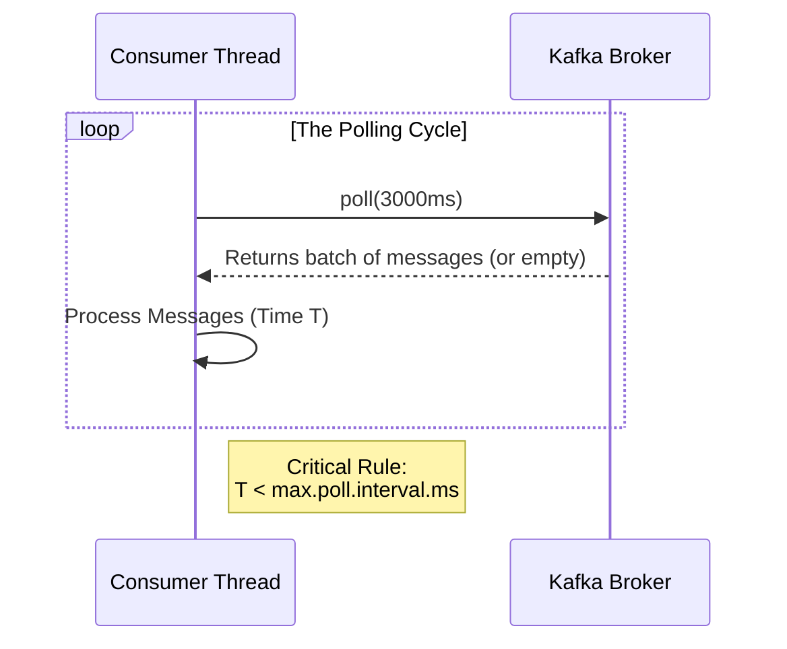

# Spring Kafka: Zero to Hero - 04d: Fine-Tuning the Engine (Polling Properties) 🏎️💨

Namaste mawa! Mana consumer ippudu chala smart ga undi. Kani, daani performance and stability ni inka penchadaniki, manam konni "engine settings" ni tune cheyali. Ee settings mana consumer broker tho ela matladutundo control chestai.

Rendu chala important properties gurinchi thelusukundam: `pollTimeout` and `max.poll.interval.ms`.

---

### 1. `pollTimeout`: "Entha Sepu Wait Cheyali?" ⏳

Mana consumer thread velli Kafka broker ni "Hey, emaina kotha messages unnaya?" ani adugutundi. Ee adagadaanne `poll()` antam.

`pollTimeout` ante, mana consumer ee `poll()` call lo entha sepu messages kosam wait cheyalo cheppadam.
*   **Value**: Milliseconds lo istham. Default ga `5000` (5 seconds).
*   **Trade-off**:
    *   **High Timeout**: Ekkuva sepu wait chestundi. Network calls thagguthai, CPU usage konchem thaggutundi. Kani, application shutdown chesetappudu slow avvochu.
    *   **Low Timeout**: Thakkuva sepu wait chestundi. Application responsive ga untundi, kani broker ki ekkuva network calls velthai.

### 2. `max.poll.interval.ms`: "Nenu Brathike Unna!" ❤️

Idi chala, chala, CHALA important property mawa. Chala interview lo adugutaru, and real-world lo chala problems ki ide karanam.

*   **Ante Enti?**: Idi oka consumer `poll()` call chesaka, next `poll()` call cheyadaniki madhyalo unna maximum time. Default ga `300000` (5 minutes).
*   **Problem Enti?**: Mana listener oka batch of messages theeskuni, daanini process cheyadaniki ee `max.poll.interval.ms` kanna ekkuva time theeskunte, Kafka broker anukuntundi, "Ayyoo, ee consumer chanipoyindi (dead)!" ani. Ventane, aa consumer daggara unna partitions ni peekesi, inko healthy consumer ki istundi. Ee process ni **Rebalance** antaru.
*   **Consequence**: Mana application lo rebalances ekkuva avthunte, processing aagipothu untundi, and performance debba tintundi.

**Solution**: Mana message processing time ni batti, ee value ni sarigga set cheskovali.

---

### Configuration: Ee Properties ni Ela Set Cheyali? 🛠️

Ee rendu properties ni manam `ConcurrentKafkaListenerContainerFactory` lo `ContainerProperties` dwara set chestam.

```java
// In KafkaConsumerConfig.java

@Configuration
public class KafkaConsumerConfig {

    // ... consumerFactory() bean with max.poll.interval.ms ...
    @Bean
    public ConsumerFactory<String, String> consumerFactory() {
        Map<String, Object> props = new HashMap<>();
        props.put(ConsumerConfig.BOOTSTRAP_SERVERS_CONFIG, "localhost:9092");
        props.put(ConsumerConfig.GROUP_ID_CONFIG, "my-group-id");
        props.put(ConsumerConfig.KEY_DESERIALIZER_CLASS_CONFIG, StringDeserializer.class);
        props.put(ConsumerConfig.VALUE_DESERIALIZER_CLASS_CONFIG, StringDeserializer.class);
        // Important: Set this in consumer factory
        props.put(ConsumerConfig.MAX_POLL_INTERVAL_MS_CONFIG, "600000"); // 10 minutes
        return new DefaultKafkaConsumerFactory<>(props);
    }

    @Bean
    public ConcurrentKafkaListenerContainerFactory<String, String> kafkaListenerContainerFactory() {
        ConcurrentKafkaListenerContainerFactory<String, String> factory = new ConcurrentKafkaListenerContainerFactory<>();
        factory.setConsumerFactory(consumerFactory());

        // pollTimeout ni ikkada set chey
        factory.getContainerProperties().setPollTimeout(3000); // 3 seconds

        return factory;
    }
}
```

### Diagram: The Polling Loop 🔄



---

### 📝 Interview Point:

"**My Kafka consumer is constantly rebalancing. What could be the issue?**"
"This is a classic problem! The most likely cause is that the consumer is taking too long to process a batch of records, exceeding the `max.poll.interval.ms` timeout. When this happens, the broker assumes the consumer is dead and initiates a rebalance. To fix this, you can either:
1.  Increase the `max.poll.interval.ms` property in the consumer configuration.
2.  Reduce the number of records fetched in a single poll by tuning `max.poll.records`.
3.  Optimize the listener logic to process messages faster."

---

### Next Enti? (What's Next?)

Mawa, manam ippudu consumer side antha tune chesi, oka race car laaga ready chesam. Ippudu asalu "cargo" gurinchi matladukundam.

Real-world lo manam simple strings pampam. Complex Java objects (POJOs) pampali. Appudu serialization and deserialization ela handle cheyali? Next section lo, manam **Handling Real-World Data** gurinchi matladukundam. Let's get into the data! 📦