```mermaid
gantt
    title MANUAL vs MANUAL_IMMEDIATE
    dateFormat x
    axisFormat %s

    section MANUAL_IMMEDIATE
    Process Msg 1 & Ack : 0, 2
    Commit Msg 1        : 2, 1
    Process Msg 2 & Ack : 3, 2
    Commit Msg 2        : 5, 1

    section MANUAL
    Process Msg 1 & Ack : 0, 2
    Process Msg 2 & Ack : 2, 2
    Batch End           : 4, 1
    Commit Both Offsets : 5, 2
```

# Spring Kafka: Zero to Hero - 04e: Commit Cheyadam lo Thedalu! (MANUAL vs MANUAL_IMMEDIATE) 🤔

Namaste mawa! Manam `AckMode` gurinchi `04c` lo touch chesam. Ikkada, `MANUAL` and `MANUAL_IMMEDIATE` gurinchi inka lothuga thelusukundam. Ee rendu modes manaki offset commit meeda full control isthai, kani vaati madhyalo unna chinna theda, performance and reliability lo pedda impact chupistundi.

---

### Full Control: Why Manual Commits?

Automatic commit modes (`BATCH`, `RECORD`) chala situations lo saripothai. Kani, konni sarlu manaki inka ekkuva control kavali.
**Scenario**: Manam oka message theeskuni, daani data ni oka database lo save cheyali.
*   Database save avvakapothe, manam offset commit cheyakudadu. Leda, message miss aipothundi.
*   Database save ayyaka matrame, manam "Okay, ee message pani aipoindi" ani Kafka ki cheppali.

Ee lanti "transactional" behavior kosam manam manual commits vaadatham.

---

### 1. `AckMode.MANUAL_IMMEDIATE`: "Ventane Chey!" ⚡

*   **Ela Pani Chestundi?**: Ee mode lo, manam mana listener method lo `acknowledgment.acknowledge()` ani call cheyagane, ventane, aa consumer thread meeda ne offset commit aipothundi. The commit is synchronous on the listener thread.
*   **Pros**: Full control and immediate confirmation. Database write successful aithe, ventane commit cheyochu. Data loss risk chala thakkuva.
*   **Cons**: Prathi message ki oka separate commit request broker ki velthundi. Idi performance ni konchem thaggisthundi.

**Configuration & Code:**

```java
// In KafkaConsumerConfig.java
factory.getContainerProperties().setAckMode(ContainerProperties.AckMode.MANUAL_IMMEDIATE);

// In MessageConsumerService.java
@KafkaListener(...)
public void listen(String message, Acknowledgment ack) {
    // ... process message ...
    dbService.save(message); // DB save ayyaka
    ack.acknowledge();       // Ventane commit chey!
}
```

---

### 2. `AckMode.MANUAL`: "Aagu, Anni Oke Saari Cheddam" 🐢

*   **Ela Pani Chestundi?**: Ee mode lo, manam `acknowledgment.acknowledge()` ani call chesinappudu, offset ventane commit **avvadu**. Adi just "Ee message pani aipoindi" ani mark cheskuntundi.
*   Asalu commit eppudu avthundi? `poll()` method theeskunna batch of messages anni process aipoyaka, appudu mark chesina anni offsets ni oke saari commit chestundi (just like `BATCH` mode).
*   **Pros**: `MANUAL_IMMEDIATE` kanna better performance, endukante commits anni oke saari velthai. Kani, manaki individual message acknowledgement control untundi.
*   **Cons**: `BATCH` mode laage, batch madhyalo fail aithe, already acknowledged messages kuda malli re-process avvochu.

**Configuration & Code:**

```java
// In KafkaConsumerConfig.java
factory.getContainerProperties().setAckMode(ContainerProperties.AckMode.MANUAL);

// Listener code remains the same!
@KafkaListener(...)
public void listen(String message, Acknowledgment ack) {
    // ... process message ...
    dbService.save(message);
    ack.acknowledge();       // Ikkada commit avvadu, just mark avthundi.
}
```

### Diagram: The Timing Difference ⏳



---

### 📝 Interview Point:

"**What is the difference between `AckMode.MANUAL` and `AckMode.MANUAL_IMMEDIATE`?**"
"Both modes give developers control over when to acknowledge a message by calling `acknowledgment.acknowledge()`.
*   **`MANUAL_IMMEDIATE`** commits the offset synchronously on the listener thread as soon as `acknowledge()` is called. This is useful for true transactional control per message but has higher overhead.
*   **`MANUAL`** queues the acknowledgment. The actual commit to Kafka happens only after the entire batch of records from the last poll has been processed. This offers better performance than `MANUAL_IMMEDIATE` as it reduces the number of commit requests to the broker, acting more like `BATCH` mode but with per-record acknowledgment logic."

---

### Next Enti? (What's Next?)

Mawa, manam ippudu offset committing lo masters aipoyam! Kani, konni sarlu manaki oka topic lo unna anni messages avasaram undadu. Konni specific messages ni matrame process cheyali anukuntam.

Next section lo, manam **Filtering Messages** gurinchi thelusukundam. Vachina messages ni listener ki ivvakunda, madyalo ne ela filter cheyalo chuddam! 🗑️➡️✅