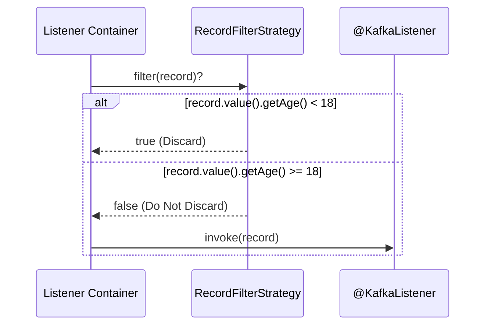

# Spring Kafka: Zero to Hero - 04f: Naaku Ee Message Oddu! (Filtering Messages) 🗑️

Namaste mawa! Manam ippudu chala messages theeskuntunnam. Kani, anni messages manaki avasaram undakapovachu. Konni messages ni manam "Ee message naaku oddu, ignore chey" ani cheppali anukuntam.

**Scenario**: Oka topic lo chala rakala events vastunnayi, kani mana specific listener kevalam konni events ni matrame process cheyali. For example, message lo "IMPORTANT" ane word unte ne process cheyali, lekapothe vadileyali.

Ee filtering ni manam listener method lo `if` condition petti cheyochu, kani adi clean approach kaadu. Spring Kafka manaki inko "gatekeeper" lanti mechanism istundi: **`RecordFilterStrategy`**.

---

### `RecordFilterStrategy`: The Bouncer at the Club Door 💂

*   **Component Type**: **Interface** (`org.springframework.kafka.listener.RecordFilterStrategy`)

Ee strategy oka bouncer laaga pani chestundi. Prathi message, mana listener method loki velle mundu, ee bouncer daggara aagi, check cheskuntundi.
*   **How it works?**: Manam oka custom filter logic rastam. Aa logic `true` return chesthe, bouncer aa message ni "Nuvvu lopaliki vellodu" ani cheppi, discard chestadu. `false` return chesthe, "Okay, nuvvu vellu" ani lopaliki pampistadu.
*   **Advantage**: Mana listener method chala clean ga untundi. Adi kevalam process cheyalsina messages gurinche alochistundi. Filtering logic antha separate ga untundi.

---

### How to Implement a Filter Strategy?

#### Step 1: Create a Custom Filter Strategy Bean
Manam `RecordFilterStrategy` interface ni implement chesi, mana custom logic `filter()` method lo rastam.

```java
package com.example.filter;

import com.example.model.User; // Assuming we are working with User objects
import org.apache.kafka.clients.consumer.ConsumerRecord;
import org.springframework.kafka.listener.RecordFilterStrategy;
import org.springframework.stereotype.Component;

@Component("myUserFilterStrategy") // Bean ki oka peru isthunnam
public class MyUserFilterStrategy implements RecordFilterStrategy<String, User> {

    @Override
    public boolean filter(ConsumerRecord<String, User> consumerRecord) {
        // Filter out users who are under 18
        boolean shouldDiscard = consumerRecord.value().getAge() < 18;
        if (shouldDiscard) {
            System.out.println("#### -> Filtering out under-age user: " + consumerRecord.value());
        }
        return shouldDiscard;
    }
}
```

#### Step 2: Apply the Filter

Manaki rendu options unnayi.

**Option A (Global): Configure on the Container Factory**
Ee filter ni mana listener container factory ki set chesthe, aa factory use chese anni listeners ki ee filter apply avthundi.

```java
// In KafkaConsumerConfig.java

@Configuration
public class KafkaConsumerConfig {
    // ...
    @Bean
    public ConcurrentKafkaListenerContainerFactory<String, User> kafkaListenerContainerFactory(
            ConsumerFactory<String, User> consumerFactory,
            RecordFilterStrategy<String, User> myUserFilterStrategy) { // Mana filter ni inject chesko

        ConcurrentKafkaListenerContainerFactory<String, User> factory = new ConcurrentKafkaListenerContainerFactory<>();
        factory.setConsumerFactory(consumerFactory);
        factory.setRecordFilterStrategy(myUserFilterStrategy);

        // Important: Discard chesina messages ni kuda acknowledge chey
        // Lekapothe, rebalance ayinappudu avi malli vastai
        factory.setAckDiscarded(true);

        return factory;
    }
}
```

**Option B (Specific): Configure on the `@KafkaListener`**
Oka vela manaki oka specific listener ki matrame ee filter kavali anukunte, direct ga annotation lo ne cheppochu.

```java
// In MessageConsumerService.java

@Service
public class MessageConsumerService {

    @KafkaListener(topics = "user-topic",
                   groupId = "user-group",
                   filter = "myUserFilterStrategy") // Ikkada mana filter bean peru ivvali
    public void listenToUsers(User user) {
        // Ekkadiki kevalam 18+ users matrame vastaru
        System.out.println("Processing user: " + user);
    }
}
```

### Diagram: The Filtering Flow 🛡️



---

### 📝 Interview Point:

"**How can you prevent certain messages from being processed by a `@KafkaListener`?**"
"Spring Kafka provides a `RecordFilterStrategy`. We can create a bean implementing this interface and define our custom filtering logic. This strategy can be applied globally by setting it on the `ConcurrentKafkaListenerContainerFactory`, or for a specific listener by referencing the filter bean's name in the `filter` attribute of the `@KafkaListener` annotation. It's also a best practice to set `ackDiscarded` to `true` on the factory to ensure the offsets for these discarded messages are committed and not redelivered."

---

### Next Enti? (What's Next?)

Mawa, ippudu manam messages ni filter cheyadam nerchukunnam. Kani, oka vela manam oka message ni process chesi, daani result ni inko topic ki pampali anukunte? Ee "Request-Reply" pattern ni Spring Kafka lo ela implement cheyalo chala mandiki theliyadu.

Next section lo, manam `@SendTo` annotation tho ee pattern ni ela easy ga achieve cheyalo chuddam. Get ready for some cool stuff! 🚀➡️💌