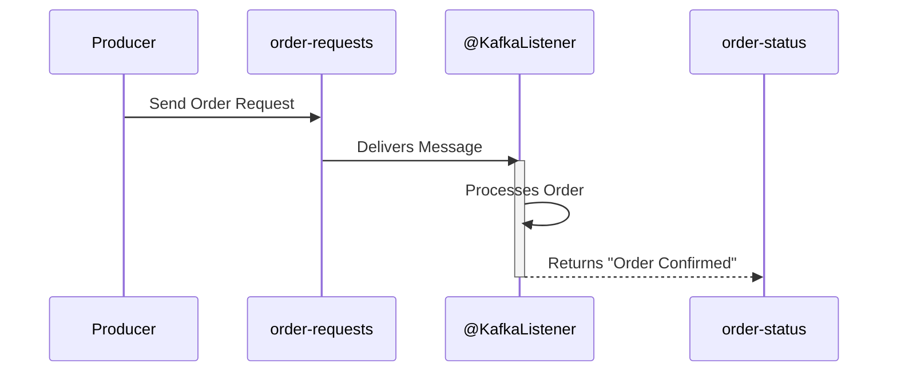

# Spring Kafka: Zero to Hero - 04g: Okati Theesko, Okati Pampu! (@SendTo) 🚀➡️💌

Namaste mawa! Manam ippudu vachina messages ni filter cheyadam chusam. Kani, konni sarlu manam oka message ni theeskuni, daanini process chesi, aa result ni inko topic ki pampali anukuntam. Ee pattern ni **Request-Reply** or **Process-and-Forward** antaru.

**Scenario**: Oka `order-requests` topic lo kotha order vachindi. Mana listener aa order ni process chesi (e.g., payment verify chesi), "Order Confirmed" ane result ni `order-status` ane topic loki pampali.

Ee pani cheyadaniki, manam listener lo `KafkaTemplate` ni inject chesi, manual ga `send()` cheyochu. Kani, Spring manaki inka easy way ichindi: **`@SendTo`** annotation.

---

### `@SendTo`: The Automatic Forwarder 📬

Ee annotation chala simple and powerful.
*   **How it works?**: Manam mana `@KafkaListener` method ni `void` kakunda, oka value ni return chesela raasi, daani meeda `@SendTo` annotation pedatham.
*   Appudu, Spring Kafka aa method return chesina value ni theeskuni, automatic ga manam `@SendTo` lo cheppina topic ki pampestundi.

### How to Implement `@SendTo`?

**Step 1: Update the Listener Method**
Mana listener method ippudu oka `String` (or any object) ni return cheyali.

```java
// In MessageConsumerService.java

@Service
public class MessageConsumerService {

    @KafkaListener(topics = "order-requests")
    @SendTo("order-status") // Process chesaka, ee topic ki pampu!
    public String handleOrder(String orderRequest) {
        System.out.println("#### -> Processing order -> " + orderRequest);

        // ... some processing logic ...

        String orderStatus = "CONFIRMED: " + orderRequest;
        System.out.println("#### -> Forwarding status -> " + orderStatus);

        return orderStatus; // Ee return value 'order-status' topic loki velthundi
    }
}
```

**Step 2: Configure the Reply Template**
`@SendTo` pani cheyali ante, mana listener container factory ki, reply ni ela pampalo cheppadaniki oka `KafkaTemplate` kavali. Deenini manam `setReplyTemplate()` method tho configure chestam.

```java
// In KafkaConsumerConfig.java

@Configuration
public class KafkaConsumerConfig {

    // ... consumerFactory() bean ...

    @Bean
    public ConcurrentKafkaListenerContainerFactory<String, String> kafkaListenerContainerFactory(
            ConsumerFactory<String, String> consumerFactory,
            KafkaTemplate<String, String> kafkaTemplate) { // KafkaTemplate ni inject chesko

        ConcurrentKafkaListenerContainerFactory<String, String> factory = new ConcurrentKafkaListenerContainerFactory<>();
        factory.setConsumerFactory(consumerFactory);

        // Factory ki reply template ni set chey
        factory.setReplyTemplate(kafkaTemplate);

        return factory;
    }
}
```
Anthe! Ippudu `handleOrder` method return chesina prathi value, `order-status` topic loki automatic ga publish avthundi.

### Diagram: The Request-Reply Flow 🔁



---

### 📝 Interview Point:

"**How do you implement a request-reply pattern where a Kafka listener processes a message and sends a result to another topic?**"
"The most straightforward way in Spring Kafka is by using the `@SendTo` annotation on the `@KafkaListener` method.
1.  The listener method should be designed to return a value (the reply message).
2.  The `@SendTo` annotation is added to the method, with the name of the reply topic as its value (e.g., `@SendTo("reply-topic")`).
3.  Crucially, the `ConcurrentKafkaListenerContainerFactory` must be configured with a `replyTemplate` (a `KafkaTemplate` instance) which is used internally to send the reply message.
This setup cleanly separates the logic and avoids manually injecting and using a `KafkaTemplate` inside the listener method."

---

### Next Enti? (What's Next?)

Mawa, mana consumer group lo consumers add ayinappudu or remove ayinappudu, Kafka oka **Rebalance** start chestundi ani manam thelusukunnam. Appudu partitions ni malli consumers ki distribute chestundi.

Oka vela, ee rebalance jarige mundu or tarvata, manam konni specific actions (like committing offsets, cleaning up resources) cheyali anukunte ela? Ee process lo hook cheyadaniki, manam **Rebalance Listeners** vaadatham. Ee advanced topic gurinchi next section lo chuddam! ⚙️🔧