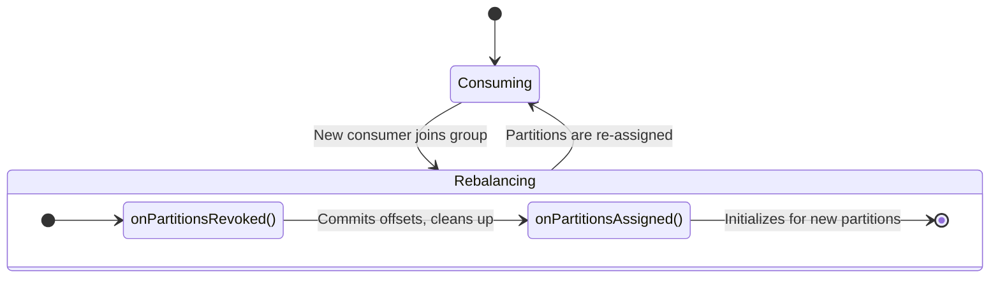

# Spring Kafka: Zero to Hero - 04h: Rebalance! The Great Partition Shuffle 🔀

Namaste mawa! Mana consumer group lo oka kotha consumer join ayina, or unna consumer vellipoina, or oka topic ki kotha partitions add ayina... appudu Kafka oka pedda "panchayati" pedutundi. Ee panchayati lo, adi partitions anni theeskuni, malli group lo unna andariki sarigga panchi pedutundi.

Ee process ne **Rebalance** antaru.

### Rebalance tho Problem Enti? 🤔

Rebalance start ayye mundu, mana consumer process chestunna pani ni aapestundi, and daaniki assign chesina partitions ni vadhilesthundi. Appudu manam jaagratthaga lekapothe:
*   Process chesina messages ki offsets commit cheyadam marchipothe, rebalance tarvata aa messages ni inko consumer malli process chestundi (**duplicate processing**).
*   Rebalance tarvata kotha partitions vachinappudu, manam daaniki ready ga undali.

---

### Solution: `ConsumerRebalanceListener` 🛡️

Ee rebalance process lo hook chesi, manam konni custom actions cheyadaniki, Spring Kafka manaki `ConsumerRebalanceListener` ane oka interface istundi. Deenilo rendu chala important methods unnayi:

1.  **`onPartitionsRevoked(Collection<TopicPartition> partitions)`**: "Hey, nee daggara nunchi ee partitions theesestunnam" ani Kafka cheppinappudu ee method call avthundi. Idi mana chance to do cleanup. For example, pending offsets ni commit cheyadam.
2.  **`onPartitionsAssigned(Collection<TopicPartition> partitions)`**: "Okay, panchayati aipoindi. Ivi nee kotha partitions" ani Kafka cheppinappudu ee method call avthundi. Idi mana chance to do setup for the new partitions.

### How to Implement a Rebalance Listener?

**Step 1: Create a Custom Rebalance Listener Bean**
Manam `ConsumerRebalanceListener` ni implement chesi, mana custom logic `onPartitionsRevoked` and `onPartitionsAssigned` methods lo rastam.

```java
package com.example.listener;

import org.apache.kafka.clients.consumer.Consumer;
import org.apache.kafka.common.TopicPartition;
import org.springframework.kafka.listener.ConsumerAwareRebalanceListener;
import org.springframework.stereotype.Component;

import java.util.Collection;

@Component
public class MyRebalanceListener implements ConsumerAwareRebalanceListener {

    @Override
    public void onPartitionsRevoked(Collection<TopicPartition> partitions) {
        System.out.println("#### -> Partitions Revoked: " + partitions);
        // Ekkada manam pending offsets ni commit cheyochu or state ni save cheskovachu.
    }

    @Override
    public void onPartitionsAssigned(Collection<TopicPartition> partitions) {
        System.out.println("#### -> Partitions Assigned: " + partitions);
        // Ekkada manam kotha partitions kosam setup cheskovachu.
    }
}
```

**Step 2: Configure the Container Factory**
Ippudu, ee listener ni mana container factory ki cheppali.

```java
// In KafkaConsumerConfig.java

@Configuration
public class KafkaConsumerConfig {

    // ... consumerFactory() bean ...

    @Bean
    public ConcurrentKafkaListenerContainerFactory<String, String> kafkaListenerContainerFactory(
            ConsumerFactory<String, String> consumerFactory,
            ConsumerAwareRebalanceListener myRebalanceListener) { // Mana listener ni inject chesko

        ConcurrentKafkaListenerContainerFactory<String, String> factory = new ConcurrentKafkaListenerContainerFactory<>();
        factory.setConsumerFactory(consumerFactory);

        // Factory ki rebalance listener ni set chey
        factory.getContainerProperties().setConsumerRebalanceListener(myRebalanceListener);

        return factory;
    }
}
```

### Diagram: The Rebalance Flow 🔄



---

### 📝 Interview Point:

"**How can you perform custom actions, such as saving state or committing offsets, just before a consumer rebalance occurs in Spring Kafka?**"
"By providing a `ConsumerRebalanceListener` to the listener container factory. This interface has two key methods: `onPartitionsRevoked` and `onPartitionsAssigned`. The `onPartitionsRevoked` method is called just before the rebalance, giving us a hook to perform cleanup actions like committing the current offsets to prevent duplicate processing. The `onPartitionsAssigned` method is called after the rebalance, allowing us to perform setup logic for the newly assigned partitions."

---

### Next Enti? (What's Next?)

Mawa, consumer side lo manam chala deep ga vellam. Concurrency, Ack modes, filtering, rebalancing... antha cover chesam! Ippudu malli data side ki velladam.

Konni sarlu, Kafka lo **Compacted Topics** vaadatham. Appudu, oka key ni delete cheste, Kafka oka special message pampistundi, daani value `null` untundi. Ee `null` payload messages ni **"Tombstone"** records antaru. Vaatini ela handle cheyalo next section lo chuddam! 🪦👻