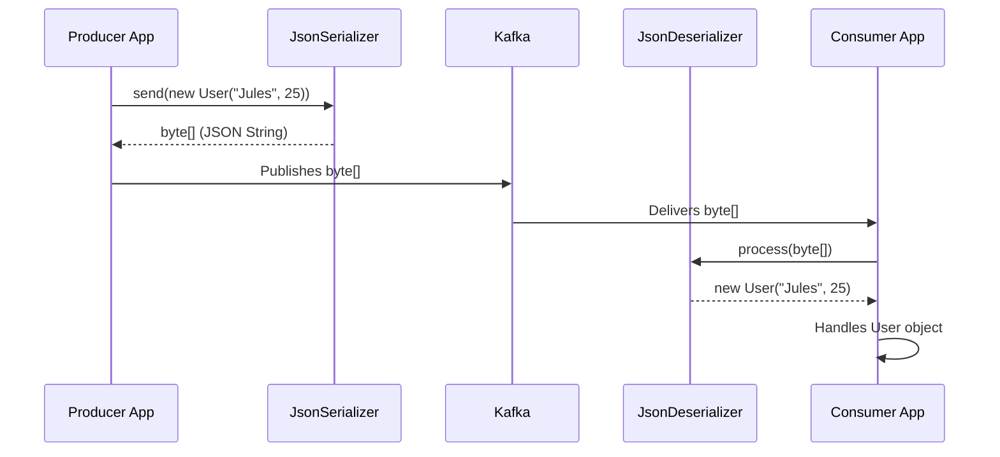

# Spring Kafka: Zero to Hero - 05a: Custom Objects (POJOs) tho Aata! 📦

Namaste mawa! Manam ippativaraku simple strings pampadam, chadavadam chesam. Kani real-world applications lo, manam strings kaadu, full-fledged Java objects (POJOs - Plain Old Java Objects) ni pampali. For example, oka `User` object, `Order` object, etc.

Ee objects ni network lo ela pampali? Direct ga pampalem. Anduke manam vaatini oka standard format loki marchali. Most popular format enti ante **JSON** (JavaScript Object Notation).

Ee section lo, manam oka `User` object ni create chesi, daanini JSON ga maarchi Kafka topic lo pampi, malli JSON nunchi `User` object ga ela marchalo chuddam. Ee process ni **Serialization** (Object to JSON) and **Deserialization** (JSON to Object) antaru.

---

### Step 1: Mana Custom Object (POJO) 🧑‍💻

First, manam `User.java` ane oka simple POJO class ni create cheddam.

```java
package com.example.model;

// Note: Getters, setters, and toString() are important for Jackson (the JSON library) to work properly.
public class User {
    private String name;
    private int age;

    // Default constructor is needed for deserialization
    public User() {
    }

    public User(String name, int age) {
        this.name = name;
        this.age = age;
    }

    // Getters and Setters...
    public String getName() { return name; }
    public void setName(String name) { this.name = name; }
    public int getAge() { return age; }
    public void setAge(int age) { this.age = age; }

    @Override
    public String toString() {
        return "User{" + "name='" + name + '\'' + ", age=" + age + '}';
    }
}
```

---

### Step 2: Producer Configuration Update 🛠️

Ippudu manam `KafkaProducerConfig.java` lo `StringSerializer` badulu, Spring Kafka icchina `JsonSerializer` ni vaadali.

```java
// In KafkaProducerConfig.java

// ... other imports
import org.springframework.kafka.support.serializer.JsonSerializer;

@Configuration
public class KafkaProducerConfig {

    @Bean
    public ProducerFactory<String, Object> producerFactory() { // Value type ni Object ga marchu
        Map<String, Object> configProps = new HashMap<>();
        configProps.put(ProducerConfig.BOOTSTRAP_SERVERS_CONFIG, "localhost:9092");
        configProps.put(ProducerConfig.KEY_SERIALIZER_CLASS_CONFIG, StringSerializer.class);
        // VALUE_SERIALIZER ni JsonSerializer ki marchu
        configProps.put(ProducerConfig.VALUE_SERIALIZER_CLASS_CONFIG, JsonSerializer.class);
        return new DefaultKafkaProducerFactory<>(configProps);
    }

    @Bean
    public KafkaTemplate<String, Object> kafkaTemplate() { // KafkaTemplate kuda <String, Object> ga marchu
        return new KafkaTemplate<>(producerFactory());
    }
}
```

---

### Step 3: Consumer Configuration Update 🛠️

Consumer side lo, manam `StringDeserializer` badulu `JsonDeserializer` vaadali. Kani ikkada oka chinna twist undi. `JsonDeserializer` ki manam ഏ type of object loki convert cheyalo cheppali.

```java
// In KafkaConsumerConfig.java

// ... other imports
import org.springframework.kafka.support.serializer.JsonDeserializer;
import com.example.model.User; // Mana User class ni import chesko

@Configuration
public class KafkaConsumerConfig {

    @Bean
    public ConsumerFactory<String, User> consumerFactory() { // Value type ni User ga marchu
        Map<String, Object> props = new HashMap<>();
        props.put(ConsumerConfig.BOOTSTRAP_SERVERS_CONFIG, "localhost:9092");
        props.put(ConsumerConfig.GROUP_ID_CONFIG, "my-group-id");

        // JsonDeserializer ni configure chey
        JsonDeserializer<User> deserializer = new JsonDeserializer<>(User.class);
        deserializer.setRemoveTypeHeaders(false);
        deserializer.addTrustedPackages("*");
        deserializer.setUseTypeMapperForKey(true);

        return new DefaultKafkaConsumerFactory<>(props, new StringDeserializer(), deserializer);
    }

    @Bean
    public ConcurrentKafkaListenerContainerFactory<String, User> kafkaListenerContainerFactory() { // Factory lo kuda User type marchu
        ConcurrentKafkaListenerContainerFactory<String, User> factory = new ConcurrentKafkaListenerContainerFactory<>();
        factory.setConsumerFactory(consumerFactory());
        return factory;
    }
}

```
**Important:** `addTrustedPackages("*")` anedi manam ഏ package nunchi ayina classes ni deserialize cheyochu ani cheptundi. Production lo specific package peru ivvadam better practice.

---

### Step 4: Services ni Update Cheddam 🔄

**Producer Service:**
```java
// In MessageProducerService.java
import com.example.model.User;

@Service
public class MessageProducerService {
    // ...
    @Autowired
    private KafkaTemplate<String, Object> kafkaTemplate; // Object type ki marchu

    public void sendUser(User user) {
        System.out.println(String.format("#### -> Producing user -> %s", user.toString()));
        this.kafkaTemplate.send("my-first-topic", user);
    }
}
```

**Consumer Service:**
```java
// In MessageConsumerService.java
import com.example.model.User;

@Service
public class MessageConsumerService {

    @KafkaListener(topics = "my-first-topic", groupId = "my-group-id", containerFactory = "kafkaListenerContainerFactory")
    public void listen(User user) { // Ikkada parameter ni User type ki marchu
        System.out.println("#### -> Consumed user -> " + user.toString());
    }
}
```

### Diagram: The SerDe Flow 🌊



---

### 📝 Interview Point:

"**How do you send and receive POJOs with Spring Kafka?**"
"We use Spring Kafka's `JsonSerializer` on the producer side and `JsonDeserializer` on the consumer side. In the `ProducerFactory`, we set the value serializer to `JsonSerializer.class`. In the `ConsumerFactory`, we configure a `JsonDeserializer` instance, specifying the target class (e.g., `new JsonDeserializer<>(User.class)`). It's also important to configure trusted packages. Finally, we update the `KafkaTemplate` and `@KafkaListener` method signatures to use the POJO type."

---

### Next Enti? (What's Next?)

Mawa, manam ippudu real-world data tho pani cheyadam start chesam. Awesome! 🤩 Kani, oka vela producer oka `User` object pampi, consumer `Order` object expect chesthe? Leda, oke topic lo multiple types of objects unte?

Next section lo, manam **Handling Multiple Event Types** gurinchi thelusukundam. Adi inka interesting ga untadi! See you there! 😉