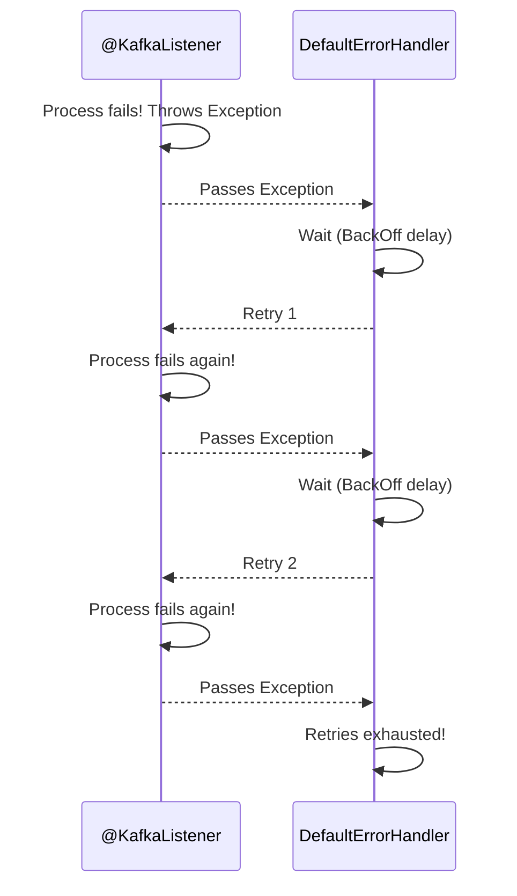

# Spring Kafka: Zero to Hero - 06b: Malli Malli Try Chey! (Retries & Backoff) 💪

Namaste mawa! Last section lo "bad messages" gurinchi matladukunnam. Ippudu inko common scenario: message baagane undi, kani daanni process cheseటప్పుడు mana listener code lo exception vachindi (e.g., external service down, database connection issue).

By default, Spring Kafka ee exception ni pattukuni, consumer ni aapestundi. Malli ide problem! 😱

**Solution**: Ventane give up cheyakunda, konni sarlu malli try cheyali. Ee temporary problems solve avvochu. Ee retry mechanism ni implement cheyadaniki, Spring Kafka manaki `DefaultErrorHandler` ane oka powerful tool istundi.

---

### `DefaultErrorHandler`: The Patient Warrior 🧘

Ee error handler, exception రాగానే, ventane give up cheyadu. Adi konni sarlu aagi, malli aa message ni process cheyadaniki try chestundi.

Ee "aagadam" (delay) ni manam oka **`BackOff`** policy tho control cheyochu.

*   **`FixedBackOff`**: Prathi retry ki madhyalo constant time gap theeskuntundi. (e.g., prathi 2 seconds ki oka saari try chey).
*   **`ExponentialBackOff`**: Prathi retry ki delay ni penchukuntu velthundi. (e.g., first 1s, then 2s, then 4s...). Idi external systems meeda load thaggisthundi.

### Configuration (`KafkaConsumerConfig.java`) 🛠️

`DefaultErrorHandler` ni `FixedBackOff` tho ela configure cheyalo chuddam.

```java
// In KafkaConsumerConfig.java

//... add these imports
import org.springframework.kafka.listener.DefaultErrorHandler;
import org.springframework.util.backoff.FixedBackOff;
import org.springframework.kafka.core.KafkaOperations; // For later use in DLT

@Configuration
public class KafkaConsumerConfig {

    // ... consumerFactory() bean ...

    @Bean
    public ConcurrentKafkaListenerContainerFactory<String, Object> kafkaListenerContainerFactory(
            ConsumerFactory<String, Object> consumerFactory) {

        // BackOff Policy: 1 second delay, 2 retries (ante, total 3 attempts)
        FixedBackOff backOff = new FixedBackOff(1000L, 2);

        // Error Handler ni create chesi, backoff policy ni pass chey
        DefaultErrorHandler errorHandler = new DefaultErrorHandler(backOff);

        ConcurrentKafkaListenerContainerFactory<String, Object> factory = new ConcurrentKafkaListenerContainerFactory<>();
        factory.setConsumerFactory(consumerFactory());

        // Factory ki mana custom error handler ni set chey
        factory.setCommonErrorHandler(errorHandler);

        return factory;
    }
}
```
Ippudu, mana `@KafkaListener` method lo exception vasthe, Spring Kafka automatic ga 1 second aagi, malli try chestundi. Ala 2 sarlu retry chesaka kuda fail aithe, appudu give up chestundi.

### Diagram: The Retry Loop 🔁



---

### 📝 Interview Point:

"**How do you implement a retry mechanism for a Kafka listener in Spring?**"
"We can configure a `DefaultErrorHandler` bean for the `ConcurrentKafkaListenerContainerFactory`. The `DefaultErrorHandler` can be constructed with a `BackOff` policy, such as `FixedBackOff` or `ExponentialBackOff`, to control the delay between retries and the maximum number of attempts. This allows the listener to automatically retry processing a message if a transient exception occurs, making the consumer more resilient."

---

### Next Enti? (What's Next?)

Mawa, manam ippudu retries ela cheyalo nerchukunnam. Kani, konni sarlu, enni sarlu retry chesina, aa message fail avthune untundi (e.g., permanent invalid data). Appudu aa message ni em cheyali? Ala vadilesthe, adi mana logs ni nimpestundi and consumer ni block cheyochu.

Ee "chanipoyina" messages ni handle cheyadaniki, manam **Dead-Letter Topic (DLT)** ane oka powerful strategy ni vaadatham. Ee concept gurinchi next section lo chuddam. It's a lifesaver! 🚑