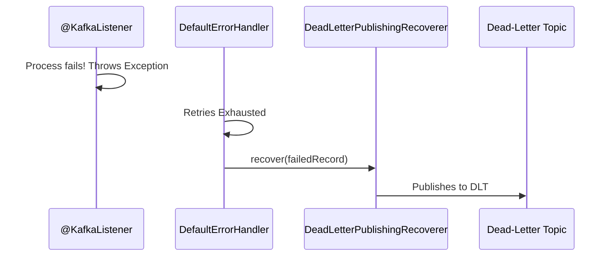

# Spring Kafka: Zero to Hero - 06c: The Graveyard for Failed Messages (Dead-Letter Topic) 🚑

Namaste mawa! Last section lo manam retries gurinchi nerchukunnam. Kani, enni sarlu retry chesina, konni messages fail avthune untai (e.g., permanent invalid data, bug in the code). Ee messages ni em cheyali?

Ikkade manaki **Dead-Letter Topic (DLT)** ane oka super-powerful strategy undi.

### Asalu DLT ante enti?

Simple ga cheppali ante, idi "chanipoyina" messages kosam oka separate topic.
Oka message ni konni sarlu retry chesaka kuda, adi inka fail avthunte, mana `DefaultErrorHandler` give up chesi, aa message ni ee DLT loki pampestundi.

**Advantages:**
*   **No More Blocking**: Fail ayina message pakkaki vellipothundi, so mana consumer aagakunda, next valid messages ni process cheskuntu velthundi.
*   **Offline Analysis**: Manam tarvata ee DLT lo unna messages ni chusi, "Enduku ee messages fail ayyayi?" ani analyze cheyochu.
*   **No Data Loss**: Fail ayina message ni delete cheyakunda, safe ga oka chota pedutunnam.

---

### DLT ni Ela Implement Cheyali?

Deeniki manaki `DeadLetterPublishingRecoverer` ane class kavali. Idi `DefaultErrorHandler` tho kalisi pani chestundi.

1.  `DeadLetterPublishingRecoverer` ki oka `KafkaTemplate` kavali, DLT ki messages pampadaniki.
2.  Ee recoverer ni manam mana `DefaultErrorHandler` ki istham.

**Configuration Update (`KafkaConsumerConfig.java`):**

```java
// In KafkaConsumerConfig.java

//... add these imports
import org.springframework.kafka.listener.DeadLetterPublishingRecoverer;
import org.springframework.kafka.core.KafkaOperations;

@Configuration
public class KafkaConsumerConfig {

    // ... consumerFactory() bean ...

    @Bean
    public ConcurrentKafkaListenerContainerFactory<String, Object> kafkaListenerContainerFactory(
            ConsumerFactory<String, Object> consumerFactory,
            KafkaOperations<String, Object> kafkaTemplate) { // KafkaTemplate ni inject chesko

        // 1. DLT Recoverer: Fail ayina messages ni DLT ki pampistundi
        DeadLetterPublishingRecoverer recoverer = new DeadLetterPublishingRecoverer(kafkaTemplate);

        // 2. BackOff Policy: 1 second delay, 2 retries (total 3 attempts)
        FixedBackOff backOff = new FixedBackOff(1000L, 2);

        // 3. Error Handler: backoff and recoverer tho create chey
        DefaultErrorHandler errorHandler = new DefaultErrorHandler(recoverer, backOff);

        ConcurrentKafkaListenerContainerFactory<String, Object> factory = new ConcurrentKafkaListenerContainerFactory<>();
        factory.setConsumerFactory(consumerFactory);
        factory.setCommonErrorHandler(errorHandler); // Factory ki error handler ni set chey

        return factory;
    }
}
```
**How does it know the topic name?**
By default, `DeadLetterPublishingRecoverer` fail ayina message ni `<original-topic-name>.DLT` ane topic loki pampistundi. So, mana case lo `my-first-topic.DLT` ane topic loki velthundi. Manam deenini `KafkaTopicConfig` lo create cheyadam marchipokudadu!

### Diagram: DLT Flow 🔄



---

### 📝 Interview Point:

"**What is a Dead-Letter Topic (DLT) and how do you implement it in Spring Kafka?**"
"A DLT is a separate topic where messages that repeatedly fail processing are sent. This prevents a single bad message from blocking the consumer.
To implement it in Spring Kafka:
1.  We configure a `DefaultErrorHandler` for the listener container factory, usually with a `BackOff` policy for retries.
2.  We create a `DeadLetterPublishingRecoverer` bean, providing it with a `KafkaTemplate` to publish messages.
3.  We pass this `recoverer` to the `DefaultErrorHandler`.
After retries are exhausted, the error handler invokes the recoverer, which publishes the failed record to a DLT (by default, `<original-topic>.DLT`), including original headers and exception details for later analysis."

---

### Next Enti? (What's Next?)

Mawa, error handling lo manam ippudu chala strong. 💪 Kani, inko pedda concept undi. Oka vela manam oka message theeskuni, database lo oka record update chesi, inko topic ki message pampali anukunte? Ee process madhyalo fail aithe? Data inconsistent avthundi.

Ee problem ni solve cheyadaniki, manam **Kafka Transactions** vaadatham. Ee "exactly-once" semantics gurinchi next section lo chuddam. It's a game-changer! 🔥