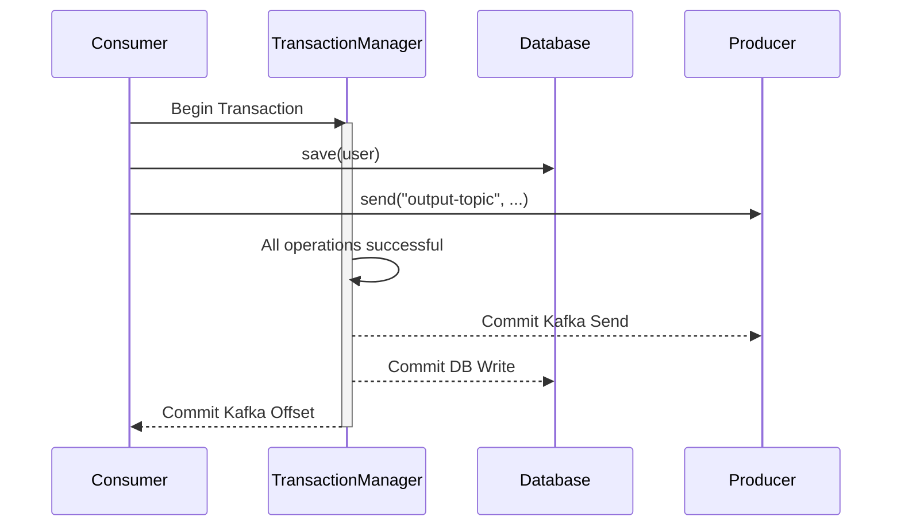

# Spring Kafka: Zero to Hero - 07a: "Exactly-Once" Magic! (Transactions) 🏦

Namaste mawa! Ippativaraku manam chusina error handling strategies chala powerful. Kani, oka critical scenario undi:

**Scenario**: Manam oka message ni consume chesi, daani tho database lo oka record update chesi, tarvata inko topic ki oka kotha message pampali. Ee process ni **"Read-Process-Write"** antaru.

Ee process madhyalo, database write aipoyaka, kani kotha message pampakamunde mana application crash aithe? 😱
*   Database update aipoindi.
*   Kani kotha message vellaledu.
*   Mana system ippudu **inconsistent state** lo undi.

Ee lanti critical situations lo, manaki "All or Nothing" behavior kavali. Ante, antha pani jaragali, leda emi jaragakudadu. Deenine **Transaction** antaru. Kafka lo idi vaadatam valla, manam **Exactly-Once Semantics** achieve cheyochu.

---

### Exactly-Once Semantics ante enti?

Ante, oka message ni **okke okka saari** process chestam, guarantee. No duplicates, no data loss, even if failures occur. Idi financial systems, e-commerce orders lanti critical applications ki chala avasaram.

### Solution: `KafkaTransactionManager` 🛡️

Spring Kafka, ee transactional behavior ni achieve cheyadaniki `KafkaTransactionManager` ni istundi. Manam cheyalsindalla:
1.  Producer ni transactional ga configure cheyali.
2.  Consumer ni transactional messages ni matrame read chesela configure cheyali.
3.  Mana listener method ni `@Transactional` tho mark cheyali.

---

### Configuration Updates 🛠️

#### 1. Producer Factory (`KafkaProducerConfig.java`)
Producer ki oka unique `transactional.id.prefix` ivvali. Idi chala important.

```java
// In KafkaProducerConfig.java

@Configuration
public class KafkaProducerConfig {

    @Bean
    public ProducerFactory<String, Object> producerFactory() {
        Map<String, Object> configProps = new HashMap<>();
        configProps.put(ProducerConfig.BOOTSTRAP_SERVERS_CONFIG, "localhost:9092");
        configProps.put(ProducerConfig.KEY_SERIALIZER_CLASS_CONFIG, StringSerializer.class);
        configProps.put(ProducerConfig.VALUE_SERIALIZER_CLASS_CONFIG, JsonSerializer.class);

        // Transactional ID prefix set chey
        configProps.put(ProducerConfig.TRANSACTIONAL_ID_CONFIG, "my-transactional-id-");

        return new DefaultKafkaProducerFactory<>(configProps);
    }
    // ... KafkaTemplate bean ...
}
```

#### 2. Consumer Factory (`KafkaConsumerConfig.java`)
Consumer ki `isolation.level` ni `read_committed` ga set cheyali. Ante, "Transaction commit ayina messages ni matrame naku ivvu" ani cheppadam.

```java
// In KafkaConsumerConfig.java

@Configuration
public class KafkaConsumerConfig {

    @Bean
    public ConsumerFactory<String, Object> consumerFactory() {
        Map<String, Object> props = new HashMap<>();
        // ... other props ...

        // Isolation Level set chey
        props.put(ConsumerConfig.ISOLATION_LEVEL_CONFIG, "read_committed");

        // ...
        return new DefaultKafkaConsumerFactory<>(props, new StringDeserializer(), deserializer);
    }
    // ...
}
```

#### 3. Transaction Manager (`KafkaTransactionManager`)
Listener container ki ee transaction manager ni set cheyali.

```java
// In KafkaConsumerConfig.java
import org.springframework.kafka.transaction.KafkaTransactionManager;

@Configuration
public class KafkaConsumerConfig {

    // ... consumerFactory() bean ...

    @Bean
    public ConcurrentKafkaListenerContainerFactory<String, Object> kafkaListenerContainerFactory(
            ConsumerFactory<String, Object> consumerFactory,
            KafkaTransactionManager<String, Object> kafkaTransactionManager) { // Inject the TX Manager

        ConcurrentKafkaListenerContainerFactory<String, Object> factory = new ConcurrentKafkaListenerContainerFactory<>();
        factory.setConsumerFactory(consumerFactory);

        // Container ki transaction manager ni set chey
        factory.getContainerProperties().setTransactionManager(kafkaTransactionManager);

        return factory;
    }

    @Bean
    public KafkaTransactionManager<String, Object> kafkaTransactionManager(ProducerFactory<String, Object> producerFactory) {
        return new KafkaTransactionManager<>(producerFactory);
    }
}
```

### Usage: `@Transactional` Listener 🚀

Ippudu mana listener method meeda `@Transactional` annotation pedithe chalu.

```java
@Service
public class TransactionalService {

    @Autowired
    private KafkaTemplate<String, Object> kafkaTemplate;

    @Autowired
    private MyDatabaseService dbService;

    @Transactional
    @KafkaListener(topics = "input-topic", groupId = "tx-group")
    public void handle(User user) {
        System.out.println("#### -> Starting transaction for user: " + user.getName());

        // Step 1: Write to database
        dbService.save(user);

        // Step 2: Send to another topic
        kafkaTemplate.send("output-topic", "PROCESSED: " + user.getName());

        System.out.println("#### -> Transaction successful!");
        // Ee method successful ga complete aithe, transaction antha commit avthundi.
        // Fail aithe, antha rollback avthundi.
    }
}
```

### Diagram: Transactional Flow 🏦



---

### 📝 Interview Point:

"**How do you achieve Exactly-Once Semantics (EOS) in a Spring Kafka consumer-producer scenario?**"
"To achieve EOS, we leverage Kafka Transactions. The key steps are:
1.  **Producer Config**: Enable transactions by setting a unique `transactional.id.prefix` in the `ProducerFactory`.
2.  **Consumer Config**: Set the `isolation.level` to `read_committed` in the `ConsumerFactory` to ensure it only reads committed messages.
3.  **Transaction Manager**: Create a `KafkaTransactionManager` bean and wire it into the `ConcurrentKafkaListenerContainerFactory`.
4.  **Transactional Listener**: Annotate the listener method with Spring's `@Transactional`. This ensures that the message consumption, business logic (like a database update), and any subsequent message production are all part of a single, atomic transaction. If any step fails, the entire operation is rolled back."

---

### Next Enti? (What's Next?)

Mawa, manam ippudu Spring Kafka lo chala advanced concepts nerchukunnam. Ippudu konni special tools gurinchi thelusukundam. Oka vela manam topic lo unna paatha messages ni re-process cheyali anukunte? Leda, oka specific message nunchi start cheyali anukunte?

Next section lo, manam **Seeking to a Specific Offset** gurinchi matladukundam. It's a very powerful tool for debugging and recovery! 🎯