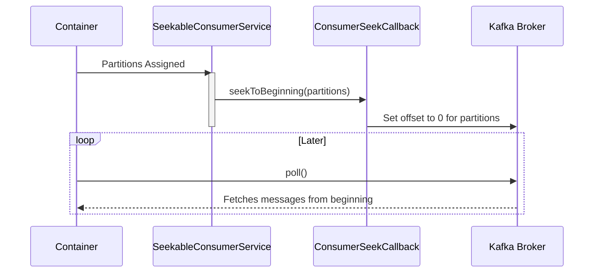

# Spring Kafka: Zero to Hero - 08a: Time Travel with Kafka! (Seeking to an Offset) 🎯

Namaste mawa! Manam ippativaraku antha "flow" lo vellipoyam. Kafka messages istunte, manam theeskuntunnam. Kani, konni sarlu maname "boss" laaga undali. Maname cheppali, "Hey Kafka, naaku aa specific message kavali" or "Malli first nunchi start chey" ani.

Ee power ni manaki icchedi **Seeking**. Seeking ante, manam oka topic partition lo, mana consumer position (offset) ni maname manually control cheyadam.

### Enduku vaadali ee Seeking? 🤔
*   **Re-processing**: Oka vela mana code lo bug valla konni messages sarigga process avvakapothe, manam వెనక్కి velli, aa messages ni malli process cheyochu.
*   **Debugging**: Production lo oka issue vachinappudu, aa specific message ni malli theeskuni, em jarugutundo chudochu.
*   **Skipping Bad Records**: Oka "poison pill" (bad message) mana consumer ni block chesthunte, daanini skip chesi munduku vellipovachu.

---

### Solution: `ConsumerSeekAware` Interface 🦸

Ee "time travel" power ni పొందాలి ante, mana listener class `ConsumerSeekAware` ane interface ni implement cheyali. Ee interface lo manaki konni important methods vastai:

1.  **`registerSeekCallback(ConsumerSeekCallback callback)`**: Container start ayinappudu, idi manaki oka `callback` object ni istundi. Ee callback tho ne manam seeking operations chestam.
2.  **`onPartitionsAssigned(Map<TopicPartition, Long> assignments, ...)`**: Mana consumer ki kotha partitions assign ayinappudu, ee method call avthundi. Ikkada manam initial offset set cheyochu.
3.  **`onPartitionsRevoked(...)`**: Partitions a consumer daggara nunchi theesukunetappudu ee method call avthundi.

### Seeking to the Beginning: A Practical Example

Oka common use case: Application start ayinapratisari, topic lo unna anni messages ni first nunchi chadavali. Deeniki manam `onPartitionsAssigned` lo `seekToBeginning` ni call chestam.

```java
package com.example.service;

import org.apache.kafka.common.TopicPartition;
import org.springframework.kafka.annotation.KafkaListener;
import org.springframework.kafka.listener.ConsumerSeekAware;
import org.springframework.stereotype.Service;

import java.util.Collection;
import java.util.Map;

@Service
public class SeekableConsumerService implements ConsumerSeekAware {

    @KafkaListener(id = "seekableListener", topics = "my-first-topic")
    public void listen(String message) {
        System.out.println("#### -> Consumed message -> " + message);
    }

    @Override
    public void onPartitionsAssigned(Map<TopicPartition, Long> assignments, ConsumerSeekCallback callback) {
        System.out.println("#### -> Partitions Assigned: " + assignments.keySet());
        // Prathi partition ni beginning ki seek chey!
        callback.seekToBeginning(assignments.keySet());
    }

    // Other methods of ConsumerSeekAware (can be left empty for now)
    @Override
    public void registerSeekCallback(ConsumerSeekCallback callback) {
        // Callback can be stored for later use
    }

    @Override
    public void onPartitionsRevoked(Collection<TopicPartition> partitions) {
        // Cleanup if needed
    }
}
```

---

### Diagram: The Seek Flow 🗺️



---

### 📝 Interview Point:

"**How can you re-process all messages from the beginning of a topic in Spring Kafka?**"
"To achieve this, the listener class must implement the `ConsumerSeekAware` interface. Within the `onPartitionsAssigned` method, which is called when partitions are assigned to the consumer, we can use the provided `ConsumerSeekCallback`. By calling `callback.seekToBeginning(assignments.keySet())`, we instruct the consumer to reset its offset to the beginning for all its assigned partitions. This ensures that on every startup or rebalance, the consumer starts reading from offset 0."

---

### Next Enti? (What's Next?)

Mawa, seeking tho manam consumer position ni control cheyadam nerchukunnam. Inko similar power undi: **Pausing and Resuming**.

Oka vela manam oka external system down ayindani thelisinappudu, kontha sepu messages theeskovadam aapali anukunte? Appudu manam consumer ni `pause()` cheyochu. System malli up ayyaka, `resume()` cheyochu. Ee concept gurinchi next section lo chuddam! ⏸️▶️