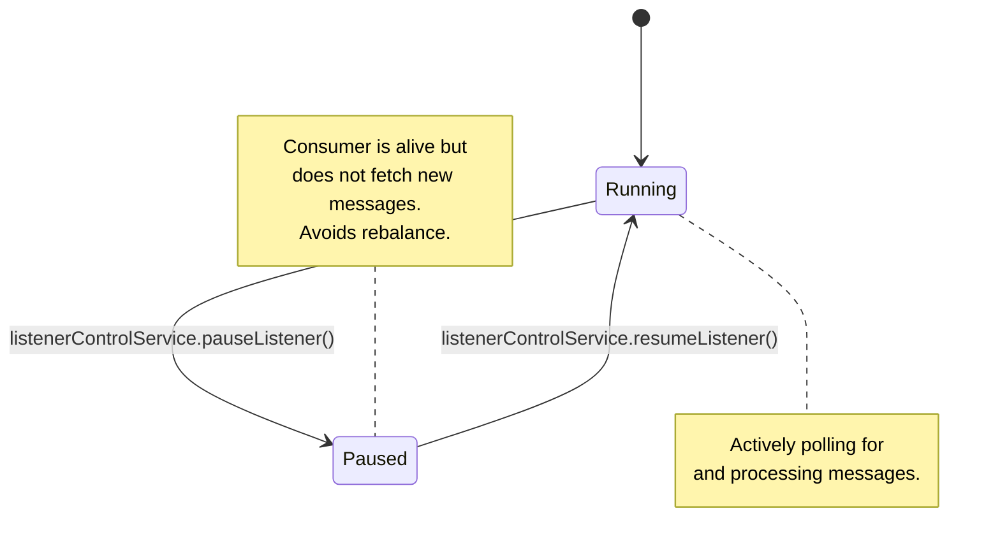

# Spring Kafka: Zero to Hero - 08b: Take a Break! (Pausing and Resuming Consumers) ⏸️▶️

Namaste mawa! Last section lo manam Kafka lo time travel chesam. Ippudu inko practical and powerful feature gurinchi thelusukundam: **Pausing and Resuming**.

**Scenario**: Mana Kafka listener oka message theeskuni, daanini process chesi, result ni oka external API ki pampali anukondi. Kani, aa external API down ayindi! 😱 Appudu manam messages theeskuni em cheyalem, anni fail avthai.

Ee situation lo, "Hey consumer, kontha sepu aagu. Nenu API status check chesi, adi malli up ayyaka cheptha, appudu resume chey" ani manam cheppochu. Idi chala manchi practice.

---

### Solution: `KafkaListenerEndpointRegistry` 🚦

Ee pause/resume operation ni cheyadaniki, Spring manaki `KafkaListenerEndpointRegistry` ane oka powerful bean istundi. Idi mana application lo unna anni `@KafkaListener` containers ki oka central control panel lantidi.

Deenitho manam:
1.  Application lo unna anni listeners ni theeskovachu.
2.  Oka specific listener ni (daani `id` tho) select cheskovachu.
3.  Aa listener container ni `pause()` or `resume()` cheyochu.

### How to Implement Pause and Resume

Manam oka service or controller lo `KafkaListenerEndpointRegistry` ni `@Autowired` cheskuni, daani meeda operations perform cheyochu.

**Step 1: Listener ki oka ID ivvu**
First, mana listener ki oka unique `id` ivvali. Appude manam daanini easy ga pattukogalam.

```java
// In MessageConsumerService.java

@Service
public class MessageConsumerService {

    @KafkaListener(id = "my-awesome-listener", topics = "my-first-topic")
    public void listen(String message) {
        System.out.println("#### -> Consumed message -> " + message);
    }
}
```

**Step 2: Registry ni use chesi Control Chey**
Ippudu, manam oka separate service lo registry ni use chesi ee listener ni control cheddam.

```java
package com.example.service;

import org.springframework.beans.factory.annotation.Autowired;
import org.springframework.kafka.config.KafkaListenerEndpointRegistry;
import org.springframework.kafka.listener.MessageListenerContainer;
import org.springframework.stereotype.Service;

@Service
public class ListenerControlService {

    @Autowired
    private KafkaListenerEndpointRegistry registry;

    public void pauseListener() {
        System.out.println("#### -> Pausing the listener...");
        MessageListenerContainer container = registry.getListenerContainer("my-awesome-listener");
        if (container != null) {
            container.pause();
        }
    }

    public void resumeListener() {
        System.out.println("#### -> Resuming the listener...");
        MessageListenerContainer container = registry.getListenerContainer("my-awesome-listener");
        if (container != null) {
            container.resume();
        }
    }
}
```
Ippudu manam `pauseListener()` or `resumeListener()` methods ni call cheste, mana consumer aaguthundi or malli start avthundi.

---

### Diagram: The Lifecycle States 🚦



---

### 📝 Interview Point:

"**How can you programmatically pause and resume a specific `@KafkaListener` in a running Spring application?**"
"We can use the `KafkaListenerEndpointRegistry` bean provided by Spring.
1.  First, we assign a unique `id` to our `@KafkaListener` annotation.
2.  Then, we can `@Autowired` the `KafkaListenerEndpointRegistry` into any other bean (like a controller or service).
3.  We use `registry.getListenerContainer("listener-id")` to get the specific `MessageListenerContainer`.
4.  Finally, we can call the `.pause()` and `.resume()` methods on the container instance to control its lifecycle dynamically."

---

### Next Enti? (What's Next?)

Mawa, manam ippudu chala advanced topics cover chesam. Mana application ni ela test cheyali? 🤔 Kafka broker ni antha setup cheyakunda, unit and integration tests ela rayali?

Next section lo, manam **Testing with `@EmbeddedKafka`** gurinchi nerchukundam. Idi tests ni chala easy and fast ga chestundi. Let's get ready to test our code! ✅