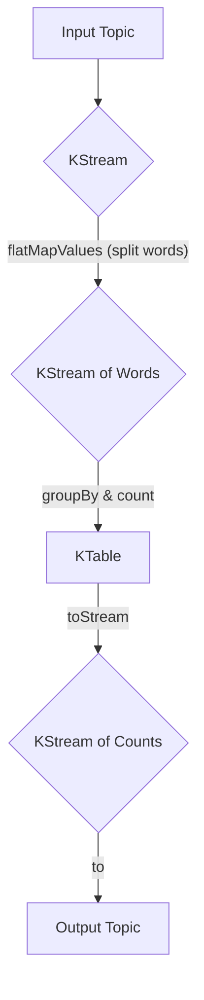

# Spring Kafka: Zero to Hero - 09b: The River of Data (Intro to Kafka Streams) 🌊

Namaste mawa! Manam ippativaraku Kafka ni oka messaging system laaga chusam. Ante, oka message ni theeskovadam, daanini process cheyadam.

Kani, Kafka lo inko super-power undi: **Kafka Streams**.

`@KafkaListener` anedi prathi message ni individual ga chustundi. Kani, Kafka Streams anedi, messages ni oka **continuous river of data** (stream) laaga chustundi. Manam aa river meeda real-time lo operations cheyochu.

**For example:**
*   Oka topic lo unna words anni count cheyochu (Word Count).
*   Multiple topics (streams) ni join cheyochu.
*   Time-based calculations cheyochu (e.g., last 5 minutes lo entha mandi users vacharu?).

---

### Key Concepts in Kafka Streams

1.  **`StreamsBuilder`**: Idi mana stream processing logic ki blueprint anamata. Manam deenitho `KStream` and `KTable` objects ni build chestam.
2.  **`KStream`**: Idi oka endless sequence of records (key-value pairs). Prathi kotha record, ee stream ki add avthundi.
3.  **`KTable`**: Idi oka topic ki "current state" ni represent chestundi. Prathi key ki, latest value matrame untundi. Idi database table laaga anukondi.
4.  **`KafkaStreams`**: Ee object, `StreamsBuilder` lo manam define chesina logic ni theeskuni, asalu stream processing ni start chesi, manage chestundi.

---

### How Spring Simplifies Kafka Streams

Direct ga Kafka Streams API vaadali ante, manam `KafkaStreams` object ni manually start cheyali, stop cheyali, manage cheyali.

Kani, Spring Kafka manaki `@EnableKafkaStreams` ane oka simple annotation istundi.
*   Manam ee annotation ni oka `@Configuration` class meeda pedithe chalu.
*   Spring automatic ga `StreamsBuilderFactoryBean` ane oka bean ni create chestundi.
*   Ee factory bean, `KafkaStreams` object ni create chesi, daani lifecycle ni (start, stop) automatic ga manage chestundi.

**Configuration & Code Example:**
Oka simple word count application chuddam.

```java
package com.example.config;

import org.apache.kafka.common.serialization.Serdes;
import org.apache.kafka.streams.StreamsBuilder;
import org.apache.kafka.streams.kstream.KStream;
import org.apache.kafka.streams.kstream.KTable;
import org.apache.kafka.streams.kstream.Produced;
import org.springframework.context.annotation.Bean;
import org.springframework.context.annotation.Configuration;
import org.springframework.kafka.annotation.EnableKafkaStreams;

import java.util.Arrays;

@Configuration
@EnableKafkaStreams
public class KafkaStreamsConfig {

    @Bean
    public KStream<String, String> kStream(StreamsBuilder streamsBuilder) {
        // 1. "input-topic" nunchi stream theesko
        KStream<String, String> stream = streamsBuilder.stream("input-topic");

        // 2. Stream tho pani chey!
        KTable<String, Long> wordCounts = stream
                .flatMapValues(value -> Arrays.asList(value.toLowerCase().split("\\W+")))
                .groupBy((key, word) -> word)
                .count(); // Prathi word ni count chey

        // 3. Result ni "output-topic" ki pampu
        wordCounts.toStream().to("output-topic", Produced.with(Serdes.String(), Serdes.Long()));

        return stream;
    }
}
```

### Diagram: The Word Count Stream Flow 🏞️



---

### 📝 Interview Point:

"**How does Spring for Apache Kafka simplify the usage of Kafka Streams?**"
"Spring Kafka provides significant simplification through the `@EnableKafkaStreams` annotation and the `StreamsBuilderFactoryBean`.
1.  `@EnableKafkaStreams` on a configuration class bootstraps the necessary Spring beans for Kafka Streams.
2.  It automatically creates a `StreamsBuilderFactoryBean`, which manages the lifecycle of the underlying `KafkaStreams` instance. This means we don't have to manually call `start()` and `close()` on the streams object.
3.  We can then simply define our stream processing topology as a `@Bean` that takes the auto-configured `StreamsBuilder` as an argument, making the integration seamless and declarative."

---

### Next Enti? (What's Next?)

Mawa, manam ippudu Spring Kafka lo chala concepts nerchukunnam. Ippudu final and most important step: **Testing**. Mana code antha correct ga pani chestundo ledo, automated tests tho ela verify cheyalo next section lo chuddam. Get ready to write some tests! ✅