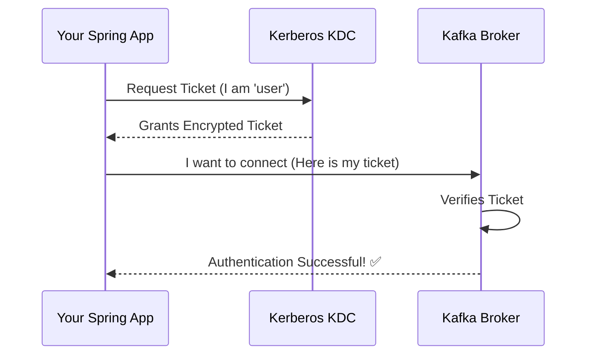

# Spring Kafka: Zero to Hero - 09a: The Bodyguard (Security with JAAS & Kerberos) 🛡️

Namaste mawa! Mana journey lo idi final, kani chala critical topic: **Security**.

Manam ippativaraku open ga unna Kafka cluster tho matladam. Kani, real-world production systems lo, data chala sensitive ga untundi. Evaru padithe vaallu mana topics lo messages pampadam, chadavadam cheyakudadu.

Anduke, mana Kafka cluster ki manam oka bodyguard ni pettali. Ee security ni implement cheyadaniki, Kafka lo **SASL (Simple Authentication and Security Layer)** ane mechanism undi. Daantlo, **Kerberos** anedi oka popular protocol.

---

### High-Level Lo ELa Pani Chestundi?

Imagine chesko, nuvvu oka top-secret club (Kafka Cluster) loki vellali anukuntunnav.
1.  Nuvvu direct ga club door daggara ki vellavu.
2.  First, nuvvu oka central security office (**Kerberos KDC - Key Distribution Center**) ki velli, nee identity (Principal) prove cheskuni, oka ticket (Ticket-Granting Ticket) theeskuntav.
3.  Aa ticket theeskuni, club door daggara unna bodyguard (Kafka Broker) ki chupistav.
4.  Bodyguard aa ticket ni verify chesi, "Okay, nuvvu correct person eh, lopaliki vellu" ani permission istadu.

Ee process antha secure ga jaragadaniki, manam `jaas.conf` ane file and `krb5.conf` (Kerberos config) lanti files ni use chestam.

Ee setup antha usually DevOps or Platform Engineering teams chuskuntaru. Kani, as a developer, manaki basic idea undali.

---

### Spring Boot lo Configuration Ela Untundi?

Manam ee security settings ni `application.properties` lo define chestam.

```properties
# 1. Security protocol ni SASL_PLAINTEXT or SASL_SSL ga set chey
spring.kafka.properties.security.protocol=SASL_PLAINTEXT

# 2. SASL mechanism ni GSSAPI (Kerberos) ga set chey
spring.kafka.properties.sasl.mechanism=GSSAPI

# 3. JAAS configuration file path ivvu
spring.kafka.properties.java.security.auth.login.config=/etc/kafka/jaas.conf

# 4. Kerberos service name
spring.kafka.properties.sasl.kerberos.service.name=kafka
```

Ee `jaas.conf` file lo, mana application (client) identity gurinchi, and daani keytab (password file) gurinchi details untai.

### Diagram: The Authentication Flow 🔐



---

### 📝 Interview Point:

"**How do you connect a Spring Kafka application to a Kerberos-secured Kafka cluster?**"
"At a high level, you need to configure the connection properties in `application.properties`.
1.  Set `spring.kafka.properties.security.protocol` to `SASL_PLAINTEXT` or `SASL_SSL`.
2.  Set `spring.kafka.properties.sasl.mechanism` to `GSSAPI`.
3.  Provide the path to the JAAS configuration file using `spring.kafka.properties.java.security.auth.login.config`.
This JAAS file contains the client's principal name and the location of the keytab file, which are used to authenticate with the Kerberos KDC and then with the Kafka brokers."

---

### The End of Our Journey! 🎉🥳

Mawa! We did it! 💪

Ee "Zero to Hero" series tho, manam Spring Kafka lo chala dooram vacham.
*   Basics nunchi start chesi...
*   Configuration, Producing, Consuming...
*   Advanced topics like Error Handling, Transactions, and even Security...
Anni cover chesam!

You now have a very strong foundation to build robust, real-world, event-driven applications using Spring Kafka. Remember, practice is key. Ee concepts ni mee own projects lo implement cheyadaniki try cheyandi.

Inka chala nerchukovali, kani ee journey lo meeru chala munduku vellaru. All the very best for your future projects!

**#HappyCoding** ✨🚀