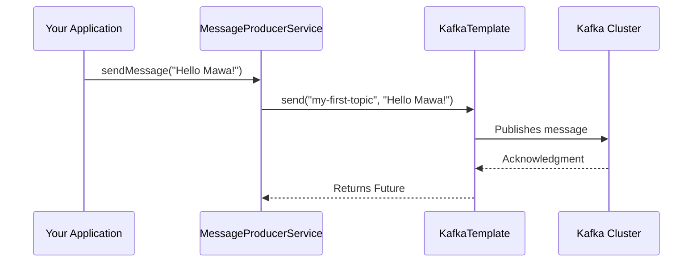

# Spring Kafka Tutorial - 02: Producer Configuration & Pampaala! 📤

Okay mawa, welcome back! Last section lo manam basics chusam. Ippudu asalu pani modaledadam. Mana application nunchi Kafka topic loki message ela pampalo (produce cheyalo) chuddam.

Deeniki manaki rendu mukhyamaina vishayalu kavali:
1.  **`ProducerFactory`**: Idi oka factory anamata. Producer instances ni ela create cheyalo cheptundi. Main ga, Kafka broker address (server location) and data ni ela serialize cheyalo (ante, network lo pampadaniki ready cheyadam) lanti settings untai.
2.  **`KafkaTemplate`**: `ProducerFactory` ni use cheskuni, ee template mana pani ni chala easy chestundi. Manam direct ga `kafkaTemplate.send(...)` ani pilisthe chalu, adi message ni theeskuni velli topic lo padesthundi. 🦸‍♂️

---

### Producer Configuration (Java Based) ☕

Spring Boot lo configuration chala easy. Manam `@Configuration` annotation unna class lo beans ni create chestam. Kindha ichina code chudu.

Ee code ni copy chesi, mee project lo `config` ane package create chesi andulo `KafkaProducerConfig.java` ane file lo pettuko.

```java
package com.example.config;

import org.apache.kafka.clients.producer.ProducerConfig;
import org.apache.kafka.common.serialization.StringSerializer;
import org.springframework.context.annotation.Bean;
import org.springframework.context.annotation.Configuration;
import org.springframework.kafka.core.DefaultKafkaProducerFactory;
import org.springframework.kafka.core.KafkaTemplate;
import org.springframework.kafka.core.ProducerFactory;

import java.util.HashMap;
import java.util.Map;

@Configuration
public class KafkaProducerConfig {

    @Bean
    public ProducerFactory<String, String> producerFactory() {
        Map<String, Object> configProps = new HashMap<>();
        // 1. Kafka Broker Address
        configProps.put(ProducerConfig.BOOTSTRAP_SERVERS_CONFIG, "localhost:9092");
        // 2. Key & Value Serializers
        configProps.put(ProducerConfig.KEY_SERIALIZER_CLASS_CONFIG, StringSerializer.class);
        configProps.put(ProducerConfig.VALUE_SERIALIZER_CLASS_CONFIG, StringSerializer.class);
        return new DefaultKafkaProducerFactory<>(configProps);
    }

    @Bean
    public KafkaTemplate<String, String> kafkaTemplate() {
        return new KafkaTemplate<>(producerFactory());
    }
}
```

**Code lo em undi?**
*   **`producerFactory()`**: Ee method `ProducerFactory` bean ni create chestundi. Indulo manam Kafka ki sambandinchina properties set chestam.
    *   `BOOTSTRAP_SERVERS_CONFIG`: Mana Kafka server ekkada run avtundo cheptam. Usually `localhost:9092`.
    *   `KEY_SERIALIZER_CLASS_CONFIG` & `VALUE_SERIALIZER_CLASS_CONFIG`: Message key and value ni `String` ga marchadaniki `StringSerializer` ni use chestunnam.
*   **`kafkaTemplate()`**: Ee method `KafkaTemplate` bean ni create chestundi, daaniki paina create chesina `producerFactory` ni isthundi.

---

### Message Pampaala! (Let's Send a Message!) 🚀

Ippudu manam `KafkaTemplate` ni use chesi message pampadaniki oka simple service create cheddam.

```java
package com.example.service;

import org.springframework.beans.factory.annotation.Autowired;
import org.springframework.kafka.core.KafkaTemplate;
import org.springframework.stereotype.Service;

@Service
public class MessageProducerService {

    private static final String TOPIC = "my-first-topic";

    @Autowired
    private KafkaTemplate<String, String> kafkaTemplate;

    public void sendMessage(String message) {
        System.out.println(String.format("#### -> Producing message -> %s", message));
        this.kafkaTemplate.send(TOPIC, message);
    }
}
```

**Diagram lo chuddam:**



---

### 📝 Interview Point:

"Interview lo 'How do you configure a Kafka Producer in Spring Boot?' ani adagachu. Appudu meeru `ProducerFactory` and `KafkaTemplate` beans gurinchi cheppali. 'We define a `ProducerFactory` bean with essential properties like `bootstrap.servers` and serializers. Then, we create a `KafkaTemplate` bean and inject the factory into it. This template abstracts the underlying producer and simplifies message sending.' ani chepthe full marks padathai!"

---

### Next Enti? (What's Next?)

Super mawa! Mana modati message ni Kafka topic loki pampesav. 🥳 Kani pampina message ni evaraina vinali ga? Lekapothe antha waste eh.

Next section lo, manam Kafka nunchi messages ni ela receive cheskovali (consume cheyali), and `@KafkaListener` antha powerful enduko chuddam. Get ready for the magic! ✨