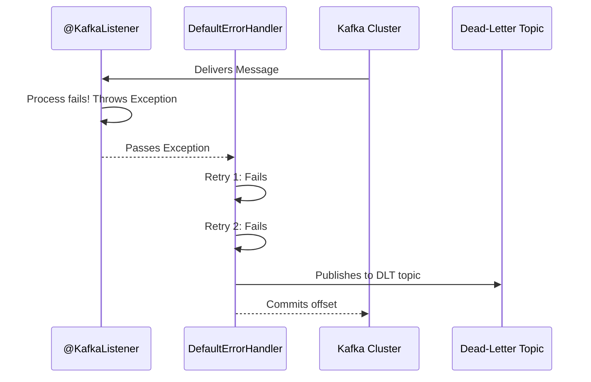

# Spring Kafka Tutorial - 05: Thappulu Jaruguthai! (Error Handling & DLT) 🤕

Mawa, manam happy ga messages pampeskovadam, receive cheskovadam chusam. Kani, life lo anni sarlu anukunnattu jaragavu kada? Programming lo kuda anthe. Sometime, message sarigga rakapovachu (corrupt avvochu) or mana code lo ne edaina exception ravochu.

Appudu mana application crash avvakunda, aa problem ni chakkaga handle cheyali. Deenine **Error Handling** antam. Spring Kafka lo idi chala important topic.

---

### Scenario 1: Bad Message - Deserialization Error 🤢

Oka vela producer oka format lo pampi, consumer inkoka format expect chesthe? Appudu `JsonDeserializer` aa message ni mana `User` object ga marchaleka thala pattukuntundi. Deenine **DeserializationException** antam.

By default, ee error vasthe, mana consumer aagipothundi and inka messages process cheyadu. Idi pedda problem!

**Solution**: `ErrorHandlingDeserializer` to the rescue! Idi mana actual deserializer ni wrap chesi, error vasthe daanini handle chestundi.

**Configuration Update (`KafkaConsumerConfig.java`):**

```java
// In KafkaConsumerConfig.java

//...
import org.springframework.kafka.support.serializer.ErrorHandlingDeserializer;
import org.springframework.kafka.support.serializer.JsonDeserializer;

@Configuration
public class KafkaConsumerConfig {

    @Bean
    public ConsumerFactory<String, Object> consumerFactory() { // Value type ni Object ga marchu
        Map<String, Object> props = new HashMap<>();
        props.put(ConsumerConfig.BOOTSTRAP_SERVERS_CONFIG, "localhost:9092");
        props.put(ConsumerConfig.GROUP_ID_CONFIG, "my-group-id");

        // Key Deserializer
        props.put(ConsumerConfig.KEY_DESERIALIZER_CLASS_CONFIG, StringDeserializer.class);
        // Value Deserializer ni ErrorHandlingDeserializer ga set chey
        props.put(ConsumerConfig.VALUE_DESERIALIZER_CLASS_CONFIG, ErrorHandlingDeserializer.class);
        // ErrorHandlingDeserializer ki asalu deserializer evaro cheppu
        props.put(ErrorHandlingDeserializer.VALUE_DESERIALIZER_CLASS, JsonDeserializer.class.getName());
        // JsonDeserializer ki properties pass chey
        props.put(JsonDeserializer.TRUSTED_PACKAGES, "*");

        return new DefaultKafkaConsumerFactory<>(props);
    }

    @Bean
    public ConcurrentKafkaListenerContainerFactory<String, Object> kafkaListenerContainerFactory() { // Type ni Object ki marchu
        ConcurrentKafkaListenerContainerFactory<String, Object> factory = new ConcurrentKafkaListenerContainerFactory<>();
        factory.setConsumerFactory(consumerFactory());
        return factory;
    }
}
```
**Listener Update (`MessageConsumerService.java`):**
Ippudu mana listener `Object` ni accept cheyali, endukante error vasthe `DeserializationException` object vastundi.

```java
// In MessageConsumerService.java
@KafkaListener(topics = "my-first-topic", groupId = "my-group-id")
public void listen(Object message) {
    if (message instanceof User) {
        System.out.println("#### -> Consumed User: " + message);
    } else if (message instanceof DeserializationException) {
        System.err.println("!!!! -> Deserialization Error: " + message);
    } else {
        System.out.println("#### -> Consumed message: " + message);
    }
}
```

---

### Scenario 2: Processing Error & Dead-Letter Topic (DLT) 📬

Message correct ga vachindi, kani daanni process cheseటప్పుడు mana code lo ne exception vachindi anuko (e.g., Database down). Appudu aa message ni em cheyali? Malli malli try cheste problem solve avvakapovachu.

**Solution**: **Dead-Letter Topic (DLT)**. Oka message konni sarlu try chesina tarvata kuda fail aithe, daanini pakkana petti, oka separate topic loki pampestham. Aa topic ne DLT antaru. Tarvata manam aa DLT lo unna messages ni chusi, enduku fail ayyayo analyze cheyochu.

**Configuration (`KafkaConsumerConfig.java`):**
`DefaultErrorHandler` and `DeadLetterPublishingRecoverer` use chesi idi configure cheddam.

```java
// In KafkaConsumerConfig.java

// ... add these imports
import org.springframework.kafka.core.KafkaOperations;
import org.springframework.kafka.listener.DeadLetterPublishingRecoverer;
import org.springframework.kafka.listener.DefaultErrorHandler;
import org.springframework.util.backoff.FixedBackOff;

@Configuration
public class KafkaConsumerConfig {

    // ... consumerFactory() bean ...

    @Bean
    public ConcurrentKafkaListenerContainerFactory<String, Object> kafkaListenerContainerFactory(
            ConsumerFactory<String, Object> consumerFactory,
            KafkaOperations<String, Object> kafkaTemplate) { // KafkaTemplate ni inject chesko

        // DLT Recoverer: Fail ayina messages ni DLT ki pampistundi
        DeadLetterPublishingRecoverer recoverer = new DeadLetterPublishingRecoverer(kafkaTemplate);

        // Error Handler: 3 sarlu try chesi, tarvata recoverer ni pilustundi
        DefaultErrorHandler errorHandler = new DefaultErrorHandler(recoverer, new FixedBackOff(1000L, 2)); // 1 sec delay, 2 retries (total 3 attempts)

        ConcurrentKafkaListenerContainerFactory<String, Object> factory = new ConcurrentKafkaListenerContainerFactory<>();
        factory.setConsumerFactory(consumerFactory);
        factory.setCommonErrorHandler(errorHandler); // Factory ki error handler ni set chey
        return factory;
    }
}
```
By default, `DeadLetterPublishingRecoverer` creates a topic named `<original-topic-name>.DLT`. So, mana case lo `my-first-topic.DLT` ane topic create avthundi.

### Diagram: DLT Flow 🔄



---

### 📝 Interview Point:

"**How do you handle message processing failures in a Kafka listener?**" ani adigithe, DLT gurinchi cheppadam chala important.
"We configure a `DefaultErrorHandler` for the listener container factory. This handler can be configured with a `BackOff` policy for retries. For recovery, we use a `DeadLetterPublishingRecoverer`, which takes a `KafkaTemplate` to publish the failed message to a designated Dead-Letter Topic (DLT) after all retry attempts are exhausted. This prevents blocking the consumer and allows for offline analysis of failed messages."

---

### Next Enti? (What's Next?)

Mawa, manam ippudu chala strong foundation vesukunnam. Messages pampadam, receive cheskovadam, JSON tho pani cheyadam, and errors ni handle cheyadam... anni cover chesam! 💪

Inka chala advanced topics unnai, kani ee basics tho meeru chala varaku real-world scenarios ni handle cheyagalaru. Next manam inko chinna kani important topic—**Kafka Headers** gurinchi thelusukundam. Let's go! 🚀